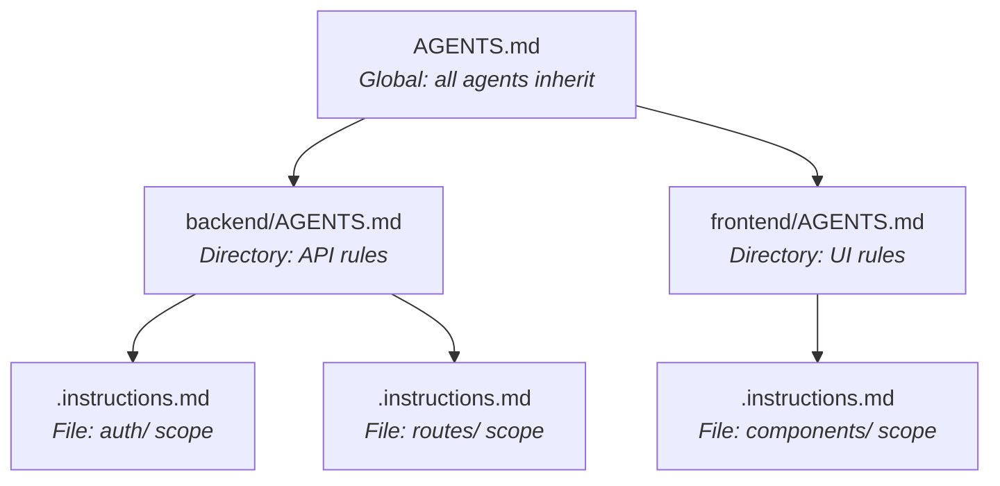
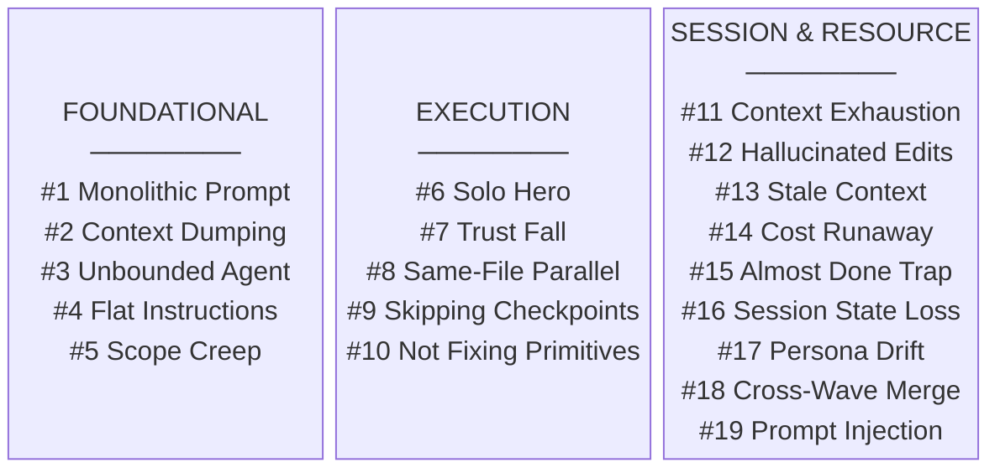
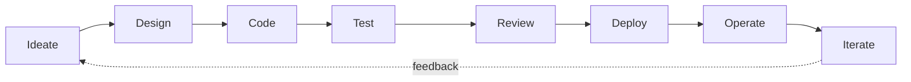
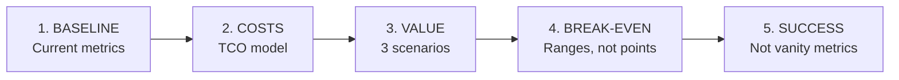
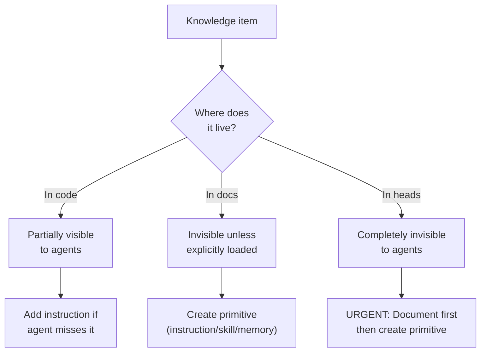

# Visual Communication Audit — Illustrator Report

**Auditor:** Illustrator (Visual Strategist)
**Scope:** Full manuscript — 15 chapters, 4 case studies, preface
**Visual inventory:** 37 Mermaid diagrams, 32 callout blocks, ~25 significant tables
**Date:** 2025

---

## Overall Visual Strategy Assessment

**The book is well-illustrated where it counts.** The manuscript demonstrates a disciplined visual philosophy: diagrams appear at structural inflection points (the PROSE hierarchy, the three-layer architecture, the wave execution model) rather than as decoration. Most diagrams pass the "faster than prose" test — a reader grasps the five-phase meta-process or the session isolation model in seconds, where the equivalent prose would take minutes. The Mermaid-only approach is smart: text-based, version-controlled, portable across HTML/PDF/EPUB.

**Visual rhythm is uneven.** Chapter 12 (Multi-Agent Orchestration) carries 7 diagrams across ~5,600 words — roughly one per 800 words. Chapter 11 (Context Engineering, ~3,900 words) and Chapter 14 (Anti-Patterns, ~5,400 words) each have just 1. The practitioner block (Ch8–14) needs this rebalanced: Ch12 is slightly over-diagrammed while Ch11 and Ch14 are under-served relative to the conceptual density of their content. The C-suite block (Ch2–7) is better balanced, averaging 1 diagram per chapter supplemented by strong tables.

**Visual type diversity is good but could improve.** The manuscript uses flowcharts (16), gantt charts (5), sequence diagrams (3), bar/XY charts (2), pie charts (1), block diagrams (1), and graph diagrams (2). Seven of the 15 chapters rely exclusively on flowcharts. The case studies show more variety (sequence diagrams, gantt charts, specialized flowcharts), which is appropriate since they depict execution timelines. Adding 1–2 non-flowchart diagrams in the main chapters would improve visual diversity.

---

## Diagram-by-Diagram Assessment

### Handbook Chapters

| Ch | Diagram Label | Type | Nodes | Verdict | Notes |
|---|---|---|---|---|---|
| 1 | PROSE Principles Hierarchy | Flowchart LR | 5 + 6 edges | **Essential** | Defines the book's conceptual foundation. Every reader needs this mental model. Edge labels ("filters rules", "fills", "constrains all execution") are precise and additive. |
| 2 | Four Phases of AI Evolution | Flowchart LR | 4 nodes | **Essential** | Establishes the phase model referenced throughout. Risk gradient in labels is clear. Well-complemented by the matching table below it. |
| 3 | Adoption J-Curve | XY Chart | 13 data points | **Essential** | The "valley" concept is central to the business case argument. The visual makes the message visceral — CFOs will scan this. |
| 4 | Three-Layer Reference Architecture | Flowchart LR | 6 nodes + 4 edges | **Essential** | Core structural diagram of the book. Labels on bidirectional arrows are clear and show information flow. Earns its full-page space. |
| 4 | Context Compounding Flywheel | Graph LR | 3 nodes, circular | **Essential** | Elegant and minimal. Three-node cycle perfectly captures the compounding argument. One of the best diagrams in the book. |
| 4 | Agentic Computing Stack | Flowchart BT | 7 layers | **Essential** | The CPU/OS/App analogy is the chapter's most powerful framing. Color-coding by layer tier (blue=foundation, yellow=constraints, green=distribution, red=application) adds signal. |
| 5 | Governance Quick-Start Assessment | Flowchart TD | 6 nodes + loops | **Essential** | Decision tree with rollback loops. Actionable for governance leads. The "Reassess quarterly" loop is a smart addition. |
| 6 | Developer Time Allocation | XY Bar Chart | 7 categories × 2 bars | **Essential** | The visual argument of the chapter — writing drops, review doubles, context engineering appears. The before/after bar comparison is immediately scannable. |
| 7 | Three-Phase Transition Roadmap | Flowchart TB | 8 nodes + rollback | **Essential** | Shows the rollback-aware structure that makes this more than a Gantt chart. Red rollback nodes provide urgency signal. |
| 8 | Agent Decision Tree | Flowchart TD | 8 nodes | **Essential** | The "when to delegate vs. code manually" framework. Every practitioner will reference this. Decision diamonds are well-labeled. |
| 9 | Seven Primitive Types | Block diagram | 7 blocks in grid | **Helpful** | Provides a visual taxonomy, but the grid layout with descriptions is dense. Works better in HTML (wider) than PDF (cramped). Consider simplifying: names only, with a legend table below. |
| 10 | PROSE Constraints Graph | Graph TD | 5 nodes + 6 bidirectional edges | **Helpful** | Shows constraint interdependencies. However, 6 bidirectional edges on 5 nodes creates visual density. Labels are abbreviated ("controls attention", "constrains safety scope") — adequate but could be clearer. Partially redundant with Ch1's PROSE diagram, though it shows a different relationship (pairwise reinforcement vs. hierarchical flow). |
| 11 | Context Window Budget | Pie chart | 5 slices | **Essential** | Budget metaphor made concrete. The proportions tell the story: 47% code context, only 16% instructions. Immediately actionable. |
| 12 | Writer/Reviewer/Tester Pattern | Sequence diagram | 4 participants | **Essential** | Shows the core multi-agent pattern. The approve/revise loop is critical. Clear, well-labeled. |
| 12 | Planner/Executor/Reviewer Pattern | Sequence diagram | 4 participants | **Essential** | Distinguishes planning from execution agents. Good complement to the previous diagram. |
| 12 | Five Autonomy Levels | Flowchart LR | 5 nodes | **Helpful** | Linear progression is clear, but this could work equally well as a table (which already exists in the chapter). Borderline redundant with the accompanying prose description. |
| 12 | Wave Structure | Flowchart TD | 9 nodes + checkpoint gates | **Essential** | The wave concept is Ch12's central contribution. The checkpoint gates between waves make the validation discipline visible. |
| 12 | Wave Execution Timeline | Gantt chart | 3 waves × 3+ tasks | **Essential** | Parallel dispatch within waves + sequential ordering across waves. Gantt is the perfect type for this — shows time, parallelism, and dependencies simultaneously. |
| 12 | Pipeline Parallelism | Gantt chart | 2 waves overlapping | **Helpful** | Adds the overlap concept (review of wave 0 while wave 1 executes). Useful but a refinement of the previous diagram. Could be combined with the wave timeline as a single, richer diagram. |
| 12 | Session Isolation | Flowchart TD | 3 agents + shared FS | **Helpful** | Clean and simple. Makes the "shared filesystem, not shared session" point visually. Could arguably be a callout or one-liner instead of a full diagram. |
| 12 | Complete Orchestration Workflow | Flowchart TD | 10 nodes | **Essential** | The summary diagram. Shows the full loop: Assess → Specialize → Partition → Order → Dispatch → Validate → Diagnose. The retry/human-decides split is well-labeled. |
| 13 | Five Execution Phases | Flowchart LR | 6 nodes + adapt loop | **Essential** | The chapter's structural skeleton. AUDIT→PLAN→WAVE→VALIDATE→SHIP with ADAPT loop back. Minimal and powerful. |
| 13 | Wave Dependency Chain | Flowchart LR | 4 nodes | **Helpful** | Simple but the labels ("No deps", "Wave 0 outputs", "Wave 1 stable") add value beyond what the prose alone conveys. Earns its space marginally. |
| 13 | ADAPT Loop | Flowchart LR | 4 nodes + cycle | **Helpful** | The DETECT→DIAGNOSE→ADJUST→EXECUTE cycle. Clean and well-labeled. Complements the five-phase diagram by zooming into the recovery path. |
| 14 | Failure Mode Decision Tree | Flowchart TD | 10 nodes | **Essential** | Diagnostic tool: Syntax error? → Tests fail? → Follows conventions? → Integrates correctly? Each path leads to a categorized fix. Highly actionable for practitioners. |
| 15 | Three-Horizon Timeline | Gantt chart | 3 sections × 2 items | **Essential** | Forward-looking summary. Gantt is the right type for temporal horizon mapping. Labels are clear and specific. |

### Case Studies

| Case Study | Diagram Label | Type | Verdict | Notes |
|---|---|---|---|---|
| APM Overhaul | Silent NameError Sequence | Sequence diagram | **Essential** | Shows the bug propagation path with precision. Perfect use of sequence diagrams — the silent swallow of the NameError is visceral. |
| Growth Engine | Build Phases Timeline | Gantt chart | **Essential** | Four-phase timeline with critical-path marking. Shows the full project arc compactly. |
| Growth Engine | Kit Automation Escalation | Sequence diagram | **Essential** | Three failed approaches → human escalation. The most instructive diagram in the case studies — shows when automation hits its wall. 4 participants, well-labeled. |
| Growth Engine | PII Audit Pipeline | Flowchart LR | **Essential** | Shows the 4-agent dispatch + one refusal. The "REFUSED — safety guardrails" path is the story. |
| Handbook Writing | Agent Team Topology | Graph TB | **Essential** | 11 personas in 4 pods. Complex but justified by the complexity of the team design. |
| Handbook Writing | Production Pipeline | Gantt chart | **Essential** | Six production phases with wave structure. Shows the full manuscript build arc. |
| Handbook Writing | Draft-Review-Revise Cycle | Sequence diagram | **Essential** | The core quality loop: draft → 3 parallel reviews → synthesize → revise → commit. Parallel review arrows are the key visual insight. |
| Handbook Writing | Dynamic Persona Creation | Flowchart TD | **Helpful** | Shows three process gaps triggering three new personas. Slightly dense with 11 nodes, but the three parallel paths make the pattern clear. |
| Publishing Pipeline | Conversion Pipeline | Flowchart LR | **Essential** | .md → .qmd → Quarto → HTML/PDF/EPUB. Clean and actionable. |
| Publishing Pipeline | "Almost Done" Trap Cascade | Flowchart TD | **Essential** | Five sequential fixes, each revealing the next. Perfect visual match for the cascade concept — the downward flow makes the trap palpable. |
| Publishing Pipeline | CI/CD Architecture | Flowchart TB | **Essential** | Two parallel subgraphs (CI: 49s vs. Local: 15min). The side-by-side comparison is immediately valuable. |

### Diagram Verdict Summary

| Verdict | Count | % |
|---|---|---|
| Essential | 29 | 78% |
| Helpful | 8 | 22% |
| Redundant | 0 | 0% |
| Confusing | 0 | 0% |

**Assessment:** No diagram should be removed. The 8 "Helpful" diagrams earn their space marginally — they add value but are less critical than the 29 "Essential" ones. The manuscript has zero visual waste, which is unusual and commendable.

---

## Visual Gaps — Concepts Needing Diagrams

| Ch | Section/Concept | Recommended Type | Why |
|---|---|---|---|
| 2 | 8-Phase Evaluation Framework (SDLC lifecycle mapping table) | Circular or linear lifecycle diagram | The 8-phase table (Ideate→Design→Code→Test→Review→Deploy→Operate→Iterate) with maturity checkboxes is the chapter's keystone, but it reads as a dense wall of text+table. A circular lifecycle diagram with maturity shading (green/yellow/red per phase) would let a CTO scan their maturity in seconds. |
| 3 | ROI calculation 5-step process | Flowchart or numbered pipeline | Steps 1–5 (Baseline→Costs→Value→Break-even→Success criteria) are described sequentially in prose. A simple 5-stage pipeline diagram would provide navigation for a reader building their own business case. |
| 5 | Compliance Framework × Capability matrix | Heatmap-style table | The 6×6 compliance matrix is information-dense and well-structured. It doesn't need replacing, but an aggregate "governance maturity radar" showing the 6 capabilities on axes (None→Basic→Enterprise) would be a powerful C-level scanning visual. |
| 8 | The practitioner mindset shift | Before/after comparison table | Ch8 describes the shift from "code writer" to "specification writer, context engineer, review specialist" — but only in prose. A 2-column comparison visual (Old Role vs. New Role, with 5–6 rows) would anchor the identity transformation. The chapter currently has 0 tables. |
| 9 | Primitive cross-platform mapping | Enhanced table or layered diagram | The cross-platform mapping table (GitHub Copilot vs. Cursor vs. Claude Code vs. Windsurf vs. OpenCode) is good but dense. A layered stack diagram showing how primitives map to each platform — with the APM universal layer on top — would reinforce the portability argument from Ch4. |
| 11 | Instruction hierarchy (global → directory → file) | Tree diagram | The three-scope hierarchy (global→directory→file) is the chapter's central practical concept, described over ~800 words of prose. A simple tree diagram showing AGENTS.md at root, backend/AGENTS.md at directory, and file-specific scopes would make the architecture immediately graspable. This is Ch11's most significant visual gap. |
| 11 | Context audit process | Flowchart or checklist diagram | The "Context Audit" section describes the process of inventorying knowledge locations (in code, in docs, in heads) and deciding which primitive type each belongs to. A flowchart or decision matrix would make this actionable. |
| 14 | Anti-pattern classification groups | Grouping/cluster diagram | The 19 anti-patterns are organized in the taxonomy table (rows 1–19) and then grouped into three sections in prose (Foundational, Execution, Session/Resource). A visual showing these three clusters — perhaps a stacked grouping with the 5 PROSE constraints color-coded — would help readers locate their specific failure mode faster. |
| 14 | Recovery playbook sequence | Flowchart | The "Worked Example: Recovering from the 'Almost Done' Trap" section walks through a multi-step recovery. A compact flowchart showing Detect→Diagnose→Choose strategy→Execute→Checkpoint would complement the decision tree diagram already in the chapter. |
| 6 | Team readiness assessment radar | Radar/spider chart | The team readiness assessment (5 dimensions scored 1–5) is described as a scoring table. A radar chart would let teams instantly see their readiness shape — where they're strong and where the gaps are. Mermaid doesn't support radar, but a table with visual indicators (▓░░░░ vs. ▓▓▓▓░) could work. |

---

## Visual Density Map

| Chapter | Words | Diagrams | Tables | Callouts | Diagrams per 1K words | Verdict |
|---|---|---|---|---|---|---|
| **Preface** | 1,047 | 0 | 0 | 3 | 0.0 | **Right** — preface doesn't need diagrams |
| **Ch1: Agentic SDLC Thesis** | 3,348 | 1 | 3 | 2 | 0.3 | **Right** — one essential diagram, multiple tables |
| **Ch2: AI-Native Landscape** | 4,161 | 1 | 5 | 0 | 0.2 | **Slightly under** — tables carry the load well, but the 8-phase SDLC framework deserves a visual |
| **Ch3: Business Case** | 4,605 | 1 | 4 | 1 | 0.2 | **Slightly under** — J-curve is perfect, but the 5-step ROI process could use a pipeline diagram |
| **Ch4: Reference Architecture** | 4,404 | 3 | 2 | 0 | 0.7 | **Right** — three strong diagrams at right density for an architecture chapter |
| **Ch5: Governance** | 4,441 | 1 | 3 | 0 | 0.2 | **Right** — decision tree + compliance tables are dense enough. One more visual is optional. |
| **Ch6: Team Structures** | 4,287 | 1 | 5 | 1 | 0.2 | **Slightly under** — the time allocation chart is great, but readiness assessment needs a visual |
| **Ch7: Planning the Transition** | 5,122 | 1 | 2 | 0 | 0.2 | **Right** — the transition roadmap is the key visual; tables handle the rest |
| **Ch8: Practitioner's Mindset** | 4,026 | 1 | 0 | 1 | 0.2 | **Under** — zero tables is anomalous for a 4K-word chapter. The mindset shift needs a comparison visual. |
| **Ch9: Instrumented Codebase** | 7,714 | 1 | 5 | 5 | 0.1 | **Under** — longest chapter, most callouts, but only 1 diagram. The primitive block diagram is good; instruction hierarchy or cross-platform mapping needs a visual. |
| **Ch10: PROSE Specification** | 5,300 | 1 | 2 | 3 | 0.2 | **Right** — the worked example sections are primarily code blocks (not diagrams), which is appropriate for this content. |
| **Ch11: Context Engineering** | 3,919 | 1 | 2 | 0 | 0.3 | **Under** — the pie chart covers the budget concept, but the instruction hierarchy (the chapter's core practical teaching) is described only in prose. Needs a tree diagram. |
| **Ch12: Multi-Agent Orchestration** | 5,587 | 7 | 1 | 0 | 1.3 | **Slightly over** — 7 diagrams in ~5.6K words. Pipeline parallelism and session isolation could be combined or cut. Consider demoting one. |
| **Ch13: Execution Meta-Process** | 3,940 | 3 | 1 | 0 | 0.8 | **Right** — three diagrams for three distinct concepts (phases, dependencies, adapt loop). Well-paced. |
| **Ch14: Anti-Patterns** | 5,412 | 1 | ~12 | 2 | 0.2 | **Under** — the dense anti-pattern taxonomy is carried entirely by tables. A classification cluster diagram and the decision tree make only 1 visual for 19 patterns + 5.4K words. |
| **Ch15: What Comes Next** | 2,796 | 1 | 0 | 0 | 0.4 | **Right** — single forward-looking timeline is appropriately minimal for a closing chapter |
| **CS: APM Overhaul** | 2,119 | 1 | 3 | 5 | 0.5 | **Right** |
| **CS: Growth Engine** | 1,760 | 3 | 0 | 3 | 1.7 | **Right** — high density but each diagram is a distinct execution phase |
| **CS: Handbook Writing** | 2,413 | 4 | 0 | 3 | 1.7 | **Right** — 4 diagrams for 4 distinct topics (topology, pipeline, cycle, personas) |
| **CS: Publishing Pipeline** | 1,739 | 3 | 1 | 3 | 1.7 | **Right** — the cascade diagram is essential for the "almost done" narrative |

### Density Distribution

- **Over-diagrammed (>1.0 per 1K words):** Ch12 only
- **Under-diagrammed (<0.2 per 1K words, with conceptual density):** Ch8, Ch9, Ch11, Ch14
- **Well-balanced:** Ch1, Ch4, Ch7, Ch10, Ch13, Ch15, all case studies

---

## Table Effectiveness Assessment

| Chapter | Table | Columns | Rows | Verdict | Notes |
|---|---|---|---|---|---|
| Ch1 | Vibe coding vs. structured | 2 | 5 | **Effective** | Clean comparison, clear labels |
| Ch2 | AI evolution phases | 5 | 4 | **Effective** | Excellent companion to the flowchart — table adds detail the diagram intentionally omits |
| Ch2 | Coding tools vs. platforms | 3 | 6 | **Effective** | Sharp differentiation in 3 columns |
| Ch2 | Capability matrix (7 tools × 11 capabilities) | 8 | 11 | **Dense but necessary** | This is the chapter's reference table. Reads well in HTML; may be cramped in PDF. The landscape class is appropriate. |
| Ch2 | 8-phase SDLC mapping | 4 | 8 | **Effective** | Good structure; would benefit from an accompanying lifecycle diagram |
| Ch3 | TCO breakdown | 5 | 5 | **Effective** | Ranges not point estimates — matches the chapter's honest-case methodology |
| Ch4 | Architecture decision matrix | 5 | 6 | **Effective** | Actionable: "Start here if..." column is well-designed for scanning |
| Ch5 | Governance maturity (6 capabilities × 4 levels) | 4 | 6 | **Effective** | Core reference table. Bolded level names aid scanning. |
| Ch5 | Compliance framework mapping (6 × 7) | 7 | 6 | **Dense but necessary** | Critical/Relevant distinction is clear. Landscape formatting is essential. |
| Ch6 | Time allocation shift | 4 | 7 | **Effective** | Good companion to the bar chart — adds "Direction" column the chart can't show |
| Ch6 | Skill value shift | 4 | 9 | **Effective** | Clean before/after with directional arrows |
| Ch6 | Team profile comparison | 4 | 4 | **Effective** | Compact, scannable |
| Ch6 | Team readiness assessment | 4 | 5+ | **Effective** | Scoring rubric; would benefit from a radar-style visual complement |
| Ch7 | Readiness assessment dimensions | 4 | 4 | **Effective** | Clean scoring rubric |
| Ch7 | Transition metrics | 4 | 7 | **Effective** | "What It Tells You / What It Doesn't" columns are unusually honest |
| Ch9 | Primitive cross-platform mapping | 6 | 7 | **Dense** | 6 platforms × 7 primitives with multi-line cells. Essential reference but challenging in PDF |
| Ch9 | Knowledge location taxonomy | 3 | 3 | **Effective** | Minimal and clear |
| Ch9 | Knowledge → primitive mapping | 2 | 7 | **Effective** | Decision aid: "If the knowledge... → It belongs in..." |
| Ch11 | Context budget breakdown | 4 | 5 | **Effective** | Complements the pie chart with exact token numbers |
| Ch12 | Wave sizing comparison | 3 | 4 | **Effective** | Compact comparison |
| Ch13 | Wave sizing factors | 3 | 4 | **Effective** | Near-identical to Ch12's table — consider whether both are needed or if one should reference the other |
| Ch14 | Anti-pattern taxonomy (master table) | 4 | 19 | **Dense but essential** | The book's most comprehensive reference table. 4 columns (number, name, constraint, summary) is the right structure. |
| Ch14 | Individual anti-pattern cards (×9) | 2 | 6 each | **Effective** | Symptom/Root cause/Constraint/Severity/Prevention/Recovery format is consistent and scannable |

### Table Recommendations

1. **Ch13 wave sizing table** is near-duplicate of Ch12's. Consider removing one and cross-referencing.
2. **Ch9 cross-platform mapping** could benefit from a simplified version alongside the full reference table — a "quick glance" showing just which platforms support which primitives (✓/~/ —).
3. No table should be converted to a diagram; the tables in this book are uniformly well-structured for their purpose.

---

## Callout Usage Assessment

| Location | Type | Content | Verdict |
|---|---|---|---|
| Preface | note (minimal) | Download link | **Appropriate** — functional navigation |
| Preface | note (minimal) | Online/LinkedIn link | **Appropriate** — functional navigation |
| Preface | tip | Reading paths (4 paths) | **Effective** — high-value for orientation |
| Ch1 | tip (×2) | Cross-reference callouts | **Appropriate** — navigation aids |
| Ch3 | note | Adoption cost framework | **Effective** — frames the cost table |
| Ch6 | note (simple) | Data caveat (projected figures) | **Essential** — honest caveating of data |
| Ch8 | tip | Cross-reference to meta-process | **Appropriate** — navigation |
| Ch9 | note (×3) | Implementation reality notes | **Effective** — practical caveats |
| Ch9 | tip (×2) | Cross-references and practical tips | **Appropriate** |
| Ch10 | note | About these stories (worked example framing) | **Effective** |
| Ch10 | tip (×2) | Cross-references to PROSE constraints | **Appropriate** |
| Ch14 | tip (×2) | Cross-references | **Appropriate** |
| CS: APM | note (×2) | Part IV intro, context setting | **Appropriate** |
| CS: APM | tip (×2) | TL;DR, try-this exercise | **Effective** — the "Try This" format is excellent |
| CS: APM | note | Canonical metrics | **Essential** — grounds the data |
| CS: Growth | tip (×2) | Key takeaways, try-this exercise | **Effective** |
| CS: Growth | note | Metrics | **Effective** |
| CS: Handbook | tip (×2) | Key takeaways, try-this exercise | **Effective** |
| CS: Handbook | note | Metrics | **Effective** |
| CS: Publishing | tip (×2) | Key takeaways, try-this exercise | **Effective** |
| CS: Publishing | note | Metrics | **Effective** |

### Callout Patterns

**Strengths:**
- Case studies use a consistent template: `.callout-tip` for takeaways and exercises, `.callout-note` for metrics. This is disciplined and well-applied.
- The "Try This" exercise callouts in case studies are excellent — they turn observational content into actionable practice.
- Data caveats use `.callout-note` correctly (Ch6's "projected figures" note is honest disclosure, not a tip).

**Gaps:**
- **Ch2, Ch4, Ch5, Ch7, Ch11, Ch12, Ch13, Ch15:** Zero callouts. Some of these chapters would benefit from at least one navigation callout or key-takeaway box. Ch12's orchestration patterns and Ch11's instruction hierarchy are dense enough to warrant a "Key Principle" callout at section starts.
- No `.callout-warning` or `.callout-important` types are used anywhere. Ch14 (anti-patterns) is a natural fit for `.callout-warning` blocks around the highest-severity failure modes (Hallucinated Edits, Prompt Injection).
- Cross-references between chapters are sometimes plain text, sometimes callouts — inconsistent. Consider a consistent pattern: all cross-chapter references use `.callout-tip` with a simple icon.

---

## Top 10 Visual Recommendations

### 1. ADD: Instruction Hierarchy Tree (Ch11)
- **Priority:** High
- **Concept:** The three-scope instruction hierarchy (global → directory → file) is the chapter's most actionable teaching, described in ~800 words of prose with code examples but no structural diagram.
- **Recommended type:** Tree/flowchart (TD)
- **Spec:**

- **Why:** A reader building their first instruction hierarchy needs to see the structure, not just read about it. This is the visual gap with the highest cost-to-fix ratio in the manuscript.

### 2. ADD: Mindset Shift Comparison (Ch8)
- **Priority:** High
- **Concept:** The chapter describes the identity transformation from "code writer" to "specification writer + context engineer + review specialist" across 4K words but has zero tables and only 1 diagram.
- **Recommended type:** 2-column comparison table (not a diagram — a table is the right format)
- **Spec:**

| Dimension | Before (Code-First) | After (Agentic) |
|---|---|---|
| Primary output | Working code | Specifications + context |
| Core skill | Implementation fluency | Architecture judgment |
| Quality gate | "Does it work?" | "Is the specification clear enough?" |
| Debugging target | Code behavior | Agent behavior |
| Leverage | Typing speed | Decomposition quality |

- **Why:** Ch8 is the identity chapter. A comparison table makes the shift concrete and memorable.

### 3. ADD: Anti-Pattern Classification Clusters (Ch14)
- **Priority:** Medium-High
- **Concept:** 19 anti-patterns organized in three groups (Foundational ×5, Execution ×5, Session/Resource ×9) mapped to 5 PROSE constraints.
- **Recommended type:** Grouped flowchart or block diagram
- **Spec:**

- **Why:** The master taxonomy table has all 19 in a flat list. The grouping structure exists in the prose section headers but isn't visually represented. Practitioners diagnosing failures need to locate the right cluster first.

### 4. ADD: SDLC Lifecycle Maturity Ring (Ch2)
- **Priority:** Medium
- **Concept:** The 8-phase SDLC framework (Ideate→Design→Code→Test→Review→Deploy→Operate→Iterate) is described in a 4-column, 8-row table with maturity checkboxes.
- **Recommended type:** Linear pipeline diagram with maturity indicators
- **Spec:**

- **Why:** The 8-phase model is referenced in Ch3, Ch4, Ch15, and multiple case studies. A visual that shows the cyclical nature (Iterate feeding back to Ideate) would be referenced throughout.

### 5. CONSOLIDATE: Ch12 Pipeline Parallelism into Wave Timeline
- **Priority:** Medium
- **Concept:** The Pipeline Parallelism diagram (fig-pipeline-parallelism) shows review overlapping with next-wave execution. This concept could be integrated into the Wave Execution Timeline (fig-wave-timeline) as an extended version.
- **Why:** Reduces Ch12 from 7 diagrams to 6, improving visual rhythm without losing information. The two Gantt charts are similar enough that a combined view would be more instructive.

### 6. ADD: ROI Building Process Pipeline (Ch3)
- **Priority:** Medium
- **Concept:** The 5-step business case process (Baseline → Costs → Value Scenarios → Break-even → Success Criteria) is described in prose as sequential steps.
- **Recommended type:** Simple flowchart LR
- **Spec:**

- **Why:** CTOs and VPs building their business case need navigation through the 5-step process. The visual provides a breadcrumb trail.

### 7. ADD: Context Audit Decision Flowchart (Ch11)
- **Priority:** Medium
- **Concept:** The context audit process asks "where is this knowledge?" (in code / in docs / in heads) and then maps to primitive types.
- **Recommended type:** Decision tree
- **Spec:**

- **Why:** The audit is the most actionable section in Ch11 and is currently prose-only.

### 8. ADD: `.callout-warning` Blocks in Ch14
- **Priority:** Medium
- **Concept:** Hallucinated Edits (#12) and Prompt Injection (#19) are severity-Critical anti-patterns. They deserve visual prominence.
- **Recommended format:** `.callout-warning` callouts
- **Why:** The current 2-column card format for individual anti-patterns is uniform regardless of severity. The highest-severity patterns (where the consequence is data loss or security breach) should be visually distinguished.

### 9. IMPROVE: Seven Primitives Block Diagram (Ch9)
- **Priority:** Low
- **Concept:** The current block-beta diagram packs names, filenames, descriptions, and separators into each cell, making it dense in PDF.
- **Recommendation:** Simplify to names + filenames only; move descriptions to a companion table immediately below.
- **Why:** The diagram tries to be both a taxonomy and a description. Splitting these roles improves both the visual (cleaner grid) and the text (more detail per primitive).

### 10. ADD: Cross-references as Consistent Callouts
- **Priority:** Low
- **Concept:** The book's internal cross-references are inconsistent — sometimes inline prose ("Chapter 11 provides the methodology"), sometimes callout-tip blocks, sometimes no cross-reference at all where one is warranted.
- **Recommendation:** Standardize a `.callout-tip appearance="simple" icon=false` format for all forward/backward chapter references that include actionable navigation ("Read this next if you need X").
- **Why:** A book with 15 chapters and 4 reading paths needs consistent signposting. The preface's reading paths callout is excellent; the same discipline should apply throughout.

---

## Appendix: Mermaid Diagram Type Distribution

| Type | Count | % | Used In |
|---|---|---|---|
| Flowchart (LR/TD/TB/BT) | 23 | 62% | Ch1,2,4,5,7,8,9,12,13,14; CS-Growth, CS-Handbook, CS-Publishing |
| Gantt chart | 6 | 16% | Ch12,15; CS-Growth, CS-Handbook |
| Sequence diagram | 5 | 14% | Ch12; CS-APM, CS-Growth, CS-Handbook |
| XY Chart (bar) | 2 | 5% | Ch3,6 |
| Pie chart | 1 | 3% | Ch11 |
| Block diagram | 1 | 3% | Ch9 |
| Graph (undirected) | 1 | 3% | Ch10 |

**Diversity recommendation:** The flowchart dominance (62%) is acceptable given the content type (process-heavy methodology), but consider converting 1–2 of the simpler linear flowcharts to tables or callout lists to avoid visual monotony.

---

## Summary Verdict

The manuscript's visual strategy is **strong but uneven**. The diagrams that exist are almost uniformly well-designed — 78% are Essential, 22% are Helpful, and none are Redundant or Confusing. This is remarkable discipline.

The primary issue is **distribution**: Ch12 has 7 diagrams while Ch8, Ch9, Ch11, and Ch14 have just 1 each despite comparable conceptual density. The top 3 recommendations (instruction hierarchy tree for Ch11, mindset shift table for Ch8, anti-pattern clusters for Ch14) would close the most impactful gaps with minimal effort.

The tables are universally well-structured. The callout usage is consistent in case studies but sparse in the main chapters. Adding 3–5 strategic callouts (especially `.callout-warning` in Ch14) would improve the scanning experience.

**Net recommendation: Add 5–7 visuals, consolidate 1 in Ch12, improve 1 (Ch9 primitive grid). Total visual count moves from 37 to ~42. Net effort: moderate.**
