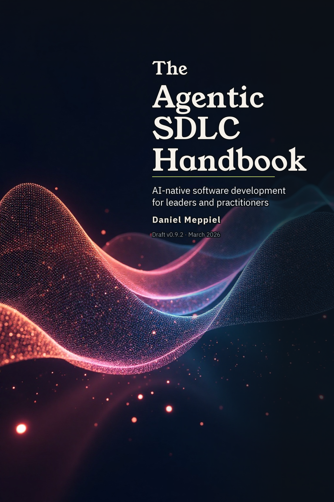

::: {.content-hidden when-format="epub"}
::: {.content-hidden when-format="pdf"}
# Download {.unnumbered}
:::
:::

::: {.content-visible when-format="epub"}
# Read Online {.unnumbered}
:::

::: {.content-visible when-format="pdf"}
# Read Online {.unnumbered}
:::

::: {.content-visible when-format="html:js"}
```{=html}
<div class="download-hero">
  <div class="download-hero__cover">
    
  </div>
  <div class="download-hero__form">
    <h2 class="download-hero__heading">Get the Pre-release Edition — PDF &amp; EPUB</h2>
    <p class="download-hero__lead">The complete handbook is free to read online. For the formatted <strong>PDF</strong> and <strong>EPUB</strong> versions — optimized for offline reading, printing, and annotation — enter your email below. You'll receive the download links instantly.</p>
    <div class="download-hero__badge">
      <strong>What you'll also get</strong>: A short series with the strongest ideas from the book, plus ~1 monthly update on the PROSE framework and APM. Unsubscribe anytime.
    </div>
    <div id="kit-form-container">
      <script async="async" data-uid="6bee764071" src="https://the-ai-native-mind.kit.com/6bee764071/index.js"></script>
    </div>
    <p class="download-hero__alt">Prefer to read online? <a href="handbook/ch01-the-agentic-sdlc-thesis.html">Start with the thesis →</a></p>
  </div>
</div>
```
:::

::: {.content-hidden when-format="html:js"}
The latest version of this handbook is always available online at:

<https://danielmeppiel.github.io/apm-handbook/>

The online edition includes interactive navigation, search, and is updated continuously as new chapters and case studies are published.
:::
