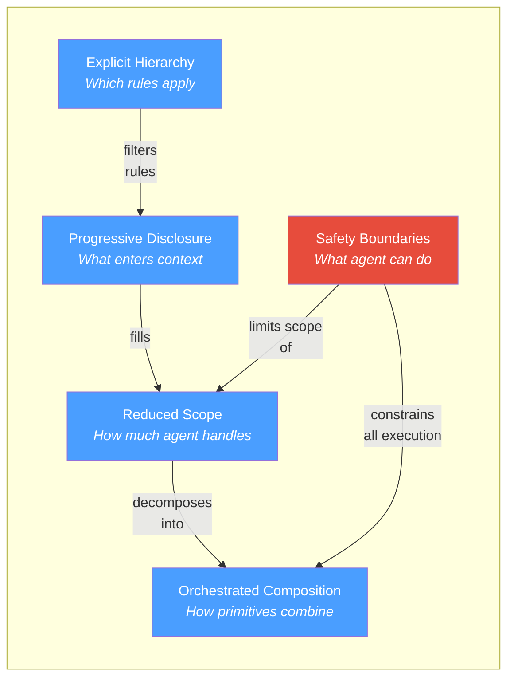

# Chapter 1: The Agentic SDLC Thesis

Every AI coding tool demos beautifully on a blank project. The question this book answers is why those same tools break on your actual codebase — and what to do about it.

---

## The Vibe Coding Cliff

You've seen the demo. An engineer opens a fresh repository, types a few sentences of natural language, and watches an AI agent produce a working application in minutes. The audience is impressed. Leadership greenlights a pilot.

Then the pilot hits your actual codebase.

The agent generates code that calls APIs your team deprecated two quarters ago. It ignores your authentication patterns and invents its own. It produces a function that duplicates logic already living three directories away — logic it couldn't see because no one told it to look there. The tests it writes pass in isolation and fail in CI because they violate conventions that exist only in your team's collective memory, never written down.

This is the Vibe Coding Cliff. It's the predictable point where AI-assisted development stops working, and it has nothing to do with how powerful the model is.

The degradation follows a pattern. On a greenfield project — no legacy code, no implicit conventions, no architecture to respect — the agent has almost nothing to get wrong. The context window is empty, and empty context can't mislead. As codebase complexity increases, the cliff gets steeper:

- **Context exhaustion.** A 10-million-line enterprise codebase cannot fit in any context window. The agent works with whatever fragment it receives, which means it works without the architectural decisions, the dependency constraints, and the tribal knowledge that make your system coherent. It's not working with less information — it's working with *different* information than a human engineer would use for the same task.
- **Hallucinated interfaces.** Without visibility into your actual API surface, the agent confabulates plausible-looking method signatures that don't exist. The code compiles in the agent's imagination and fails at build time. Worse, it sometimes calls real methods with wrong semantics — code that compiles, passes superficial review, and breaks in production.
- **Convention violations.** Your team's error-handling pattern, your logging standards, your module boundaries — none of these are visible to an agent unless someone has made them explicit. The agent doesn't break your rules on purpose. It doesn't know they exist.

The cliff isn't a bug in any particular tool. It's a structural property of how language models interact with complex systems. And it explains why adoption surveys consistently show the same split: high satisfaction on simple tasks, declining returns on complex ones. Teams consistently report that 30–60% of agent-generated code on complex tasks requires significant rework — a figure observed across multiple organizations and tool ecosystems, though no single study has established it definitively. Not because the models are weak, but because the context is.

Name any experienced engineering team that has tried to move beyond autocomplete into agentic workflows on a production codebase. They've hit this cliff. The symptoms vary — a sprint spent cleaning up agent-generated code that "worked" but violated every architectural boundary, a security review that caught agent output bypassing the team's auth patterns, a junior developer who trusted agent output that a senior would have immediately flagged — but the underlying cause is always the same.

The cliff is not about intelligence. It's about information.

Most teams respond in one of two ways. Some retreat — they restrict AI tools to autocomplete and simple boilerplate, accepting a fraction of the potential value. Others push forward with brute force — longer prompts, more files stuffed into context, increasingly elaborate workarounds — and find that the problems get worse, not better.

Neither response addresses the root cause.

## Why Tools Aren't the Answer

The natural instinct is to blame the tools and wait for better ones. Next quarter's model will have a larger context window. Next year's agent will be smarter. The reasoning is intuitive: if the AI isn't good enough, get a better AI.

This reasoning is wrong, and understanding why it's wrong is the foundation of everything that follows.

Three properties of language models are structural. They hold regardless of model size, architecture, or provider. They will hold for the foreseeable future.

**Context is finite and fragile.** Every language model operates within a context window — a fixed capacity for the information it can consider at once. Attention within that window is not uniform; information competes for focus, and content far from the point of attention gets lost. A larger window does not solve this. Doubling the window and doubling the input leaves you in the same place — or worse, because the model now has more irrelevant material competing for attention. Context is a scarce resource that degrades under load.

**Context must be explicit.** Agents can only work with externalized knowledge. The architectural decision your team made in a meeting last month, the convention that "everyone knows" but no one documented, the implicit agreement about how modules interact — these are invisible to AI. Models are stateless. What isn't in the context window doesn't exist for the agent. Your codebase contains two kinds of knowledge: what's written in the code, and what's understood by the people who wrote it. AI has access to the first kind only.

**Output is probabilistic.** The same input can produce different outputs. Language models interpret rather than execute; variance is inherent, not a bug to be fixed. Determinism comes from constraints, structure, and grounding — not from the model itself. This means reliability must be *architected*, not assumed. Unlike a compiler that either accepts or rejects your code, a language model *always produces something* — making quality failures silent and insidious.

These three properties are why better models don't solve the Vibe Coding Cliff. A more powerful model working with unstructured, incomplete, or noisy context doesn't produce better results. It produces more confident wrong answers, faster. The failure mode of a weak model is obvious — it can't do the task. The failure mode of a strong model with poor context is insidious — it produces plausible output that looks correct and silently violates your system's invariants. Context windows have grown 50–500× in five years — from GPT-3's 4K tokens in 2020 to the 200K–2M tokens available in current frontier models — yet satisfaction with AI on complex engineering tasks has not kept pace, because the bottleneck was never raw capacity — it was the structure of what fills that capacity.

## PROSE: Architectural Constraints for Human-AI Collaboration

In 2000, Roy Fielding didn't build a web framework. He published a dissertation that defined *constraints* — statelessness, uniform interface, layered system, and others — that, when followed together, produced systems with desirable properties: scalability, reliability, independent evolution. He called the style REST.

REST didn't eliminate SOAP or RPC. It didn't prescribe a technology stack. It defined an architectural style — a coherent set of constraints that, applied to the problem of distributed systems, induced properties that individual tools and protocols couldn't guarantee on their own.

**PROSE** occupies the same position for AI-native development. It defines five architectural constraints for human-AI collaboration that, applied together, address the structural failures described above. It is not a tool, not a file format, not a prompting technique. It is an architectural style.

The five constraints, and the failure modes each addresses:

| Constraint | Principle | Addresses | Induced Property |
|---|---|---|---|
| **P**rogressive Disclosure | Context arrives just-in-time, not just-in-case | Context overload — loading everything upfront wastes capacity and dilutes attention | Efficient context utilization |
| **R**educed Scope | Match task size to context capacity | Scope creep — tasks that grow beyond what an agent can hold in focus | Manageable complexity |
| **O**rchestrated Composition | Simple things compose; complex things collapse | Monolithic collapse — single mega-prompts that become unpredictable and impossible to debug | Flexibility and reusability |
| **S**afety Boundaries | Autonomy within guardrails | Unbounded autonomy — non-deterministic systems with unlimited authority | Reliability and verifiability |
| **E**xplicit Hierarchy | Specificity increases as scope narrows | Flat guidance — global instructions that pollute every context regardless of relevance | Modularity and domain adaptation |

Each constraint is necessary to address its failure mode. Together, they form a minimal sufficient set.

These constraints sound abstract. Later in this book, we trace a single pull request — 70 files changed, 2,874 tests passing, 3 human interventions, roughly 90 minutes of wall-clock time — that demonstrates what they produce in practice. That case study shows both what worked and what required human escalation. It is evidence, not a sales pitch.

**The REST parallel is specific, not decorative.** REST's statelessness constraint meant servers didn't maintain session state between requests — which seemed limiting, but induced scalability. PROSE's Reduced Scope constraint means complex work is decomposed into tasks sized to fit available context — which seems slower, but induces consistent quality. REST's uniform interface meant all resources were accessed the same way — which seemed rigid, but induced independent evolution. PROSE's Explicit Hierarchy means instructions form a global-to-local tree — which seems bureaucratic, but induces domain adaptation without context pollution.

In both cases, the constraints feel like restrictions until you see the properties they produce at scale. And in both cases, the constraints are independent of implementation — REST didn't require Apache, and PROSE doesn't require any particular IDE or AI provider.

The constraints in this book are concrete enough that they can be — and have been — implemented as packageable, distributable artifacts with formal schemas.

How the five constraints relate:

When these constraints are followed, systems exhibit reliability (consistent results from non-deterministic systems), scalability (same patterns work from scripts to large codebases), portability (works across any LLM-based agent platform), and transparency (agent behavior is inspectable and explainable).

When they're violated, the failures are equally predictable:

| Anti-Pattern | Violated Constraint | What Goes Wrong |
|---|---|---|
| **Monolithic prompt** | Orchestrated Composition | All instructions in one block; small changes produce unpredictable results; impossible to debug |
| **Context dumping** | Progressive Disclosure | Everything loaded upfront; wastes capacity; dilutes attention on what matters |
| **Unbounded agent** | Safety Boundaries | No limits on tools or authority; non-determinism plus unlimited access equals unpredictable behavior |
| **Flat instructions** | Explicit Hierarchy | Same rules everywhere; backend security rules load when editing frontend CSS |
| **Scope creep** | Reduced Scope | Task grows mid-session; agent loses track of earlier instructions as attention degrades |

Most of these anti-patterns stem from a single root cause: ignoring that context is finite and fragile. The book returns to these patterns in detail in Chapter 14.

### Honest Positioning

PROSE is one framework among emerging approaches to structured AI-assisted development. It is the one this book teaches, because it has verifiable evidence behind it. But intellectual honesty demands acknowledging the landscape.

Anthropic publishes guidelines for structuring agent interactions. LangChain and LangGraph define patterns for composing LLM workflows. AutoGen provides multi-agent conversation frameworks. Various tool-specific conventions — project rule files, instruction formats, agent configurations — encode subsets of these ideas in tool-native ways.

What distinguishes PROSE is the level of abstraction. Most alternatives operate at the tool or workflow level: how to chain calls, how to structure prompts for a specific platform. PROSE operates at the architectural level: what constraints must hold *regardless* of which tool or model you use. This is also what distinguishes REST from any specific HTTP framework — the constraints are the point, not the implementation.

The appropriate claim is not "PROSE is the only way" but "PROSE articulates constraints that any reliable AI-native development approach will need to address, whether it uses this vocabulary or not." If your current approach already satisfies these constraints under different names, this book will still be useful — it gives you a shared language and a systematic methodology.

## The Dual Path

This book serves two audiences who need different things from the same shift.

**If you lead engineering teams** — VP Engineering, CTO, Chief Architect — you need to understand what changes about organizational strategy when AI agents become participants in your software delivery lifecycle. Not the hype version. Not the vendor pitch. The structural version: what happens to team composition, how governance changes, where the new risks live, and how to evaluate ROI honestly.

Block 1 of this book (Chapters 2–7) answers those questions. It covers the market landscape and why "wait and see" is itself a decision with competitive consequences. It presents a reference architecture — a three-layer model that maps human roles, agent capabilities, and platform infrastructure across the full software lifecycle. It addresses the hard organizational questions: how team structures change, what governance looks like when agents produce code, and how to build an honest business case that doesn't rely on inflated productivity claims. Chapter 3 builds that business case — including what the productivity claims get wrong, what adoption actually costs, and when to expect returns. Every chapter produces a deliverable: an evaluation framework, a decision matrix, a governance checklist, a planning template.

**If you build software** — senior engineer, tech lead, staff developer — you need to know how to implement this Monday morning. Not theory. Not architecture diagrams. The specific disciplines: how to engineer context so agents produce reliable output, how to design the primitives that encode your team's knowledge, how to orchestrate multi-agent execution on a real codebase, and how to handle the failures that the demos never show.

Block 2 (Chapters 8–14) answers those questions. It teaches context engineering as a disciplined practice: how to build context budgets, design instruction hierarchies, create agent configurations, and orchestrate multi-step workflows across real codebases. It walks through the meta-process: audit your codebase for context gaps, plan the artifact architecture, execute in waves, validate against real output, ship. Every chapter includes worked examples with specific numbers, before-and-after comparisons, and anti-patterns drawn from real failures.

Both blocks stand on a shared foundation — this chapter — and converge in the closing chapter, which addresses where the field is heading.

You don't need to read both blocks. Start with whichever matches your role. But if you're a technical leader who also writes code, or a practitioner who needs to make the case to leadership, the cross-references between blocks are designed to support that.

| | Block 1: For Leaders | Block 2: For Practitioners |
|---|---|---|
| **Core question** | What to decide and why | What to do Monday morning |
| **Tone** | Concise, scan-friendly, outcome-oriented | Precise, evidence-based, action-oriented |
| **Evidence style** | Frameworks, checklists, decision matrices | Worked examples, specific numbers, before/after |
| **Chapters** | 2–7 | 8–14 |
| **Time to read** | ~2 hours | ~3 hours |

## What This Book Is Not

**This is not a prompt engineering guide.** Prompt engineering is a useful skill and a necessary one. But it is a small fraction of what makes AI-assisted development reliable at scale. Knowing how to write a good prompt is like knowing how to write a good SQL query — important, and insufficient for building a reliable system. This book teaches the architectural, organizational, and procedural disciplines that determine whether prompt engineering even matters.

**This is not a tool tutorial.** The methodology in this book works across AI coding tools. Where specific tools appear as examples — and they will — they illustrate a principle, not a product recommendation. The constraints are portable. The implementations vary.

**This is not a vendor whitepaper.** The author works at Microsoft. This is disclosed once and then the analysis stands on its own. Microsoft's tools and vision appear where relevant — as one data point among several in a multi-vendor landscape. Where the evidence supports a Microsoft approach, it's cited. Where it doesn't, it isn't. The author also created APM, an open-source agent package manager. APM appears in later chapters where it provides evidence that the architectural constraints work in practice; the methodology does not require it.

**This is not comprehensive.** The field moves too fast for any book to cover everything. This book is opinionated and battle-tested. It teaches one well-articulated framework, applies it to real evidence, and gives you enough structure to adapt as the landscape evolves. Where certainty exists, the book is direct. Where it doesn't — and there are many such places in a field this young — the book says so.

**This is not theory.** Every methodology claim in Block 2 traces back to at least one executed implementation. The primary evidence is a single pull request — large enough to be non-trivial, documented enough to be verifiable, and messy enough to be honest. The book doesn't claim this generalizes to every codebase. It claims the constraints and disciplines are sound, and shows you exactly what happened when they were applied.

---

The Vibe Coding Cliff is real, and every team scaling AI-assisted development will hit it. The question is whether you hit it with nothing but a more powerful model and a longer prompt — or with an architectural style designed to make human-AI collaboration reliable.

The constraints are the point. Let's see what they produce.
