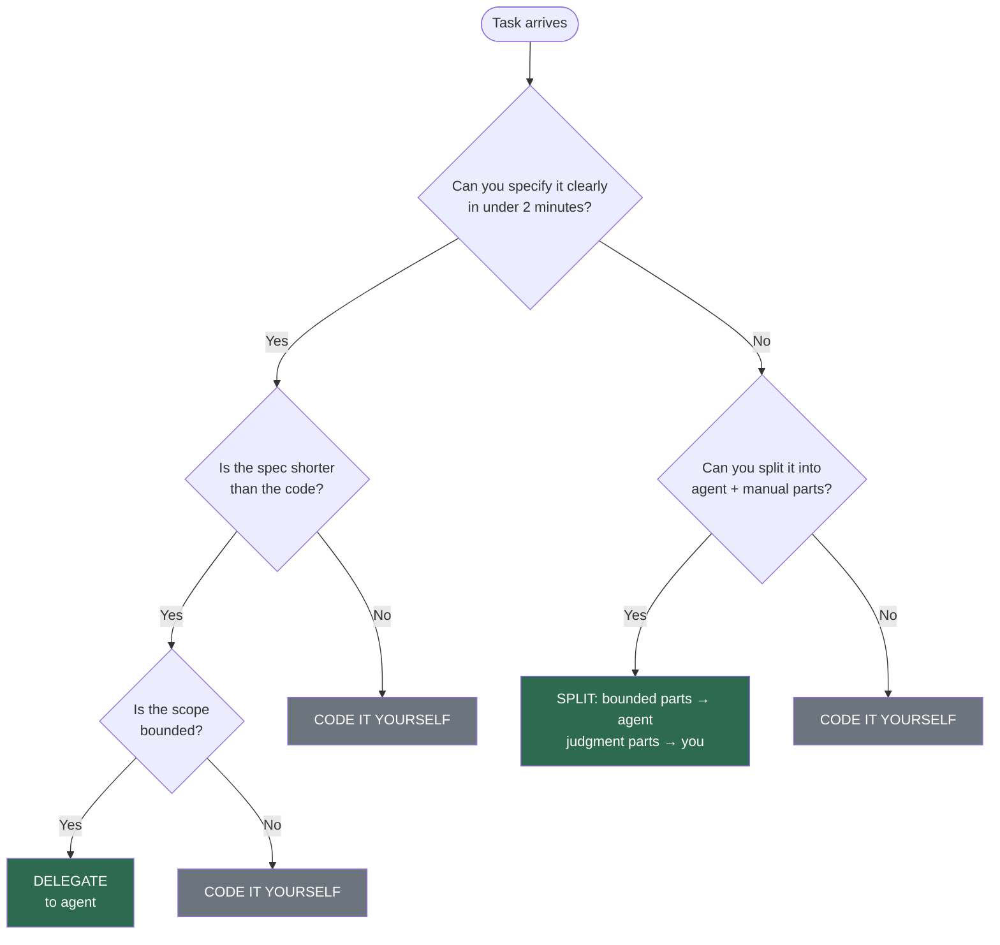

Block 1 answered what to decide. Block 2 answers what to do. But before doing anything, you need to understand what changes about how you think — because the shift from traditional development to agentic development is not primarily a shift in tools. It is a shift in role.

---

## The Autocomplete Trap

Most developers first encounter AI coding tools as autocomplete. You type a function signature, the tool suggests the body, you hit Tab. The interaction is local: one prompt, one completion, one edit. The mental model is straightforward — the AI predicts what you were going to type anyway, and sometimes it's right.

This mental model is a trap. Not because autocomplete is bad — it's useful, and it will remain useful — but because it teaches you the wrong relationship with AI. It teaches you that AI is a text predictor that occasionally saves keystrokes. When you carry that mental model into agentic development, everything breaks.

An agent is not predicting your next line. An agent is attempting to execute a task — reading files, making decisions about structure, writing code across multiple locations, running tests, interpreting failures. The difference is not incremental. Autocomplete fails gracefully: a bad suggestion costs you a Tab press and a backspace. An agent fails expensively: it produces code that compiles, passes a superficial review, and encodes the wrong assumptions into your system. You don't catch the failure at the moment of generation. You catch it in code review, or in CI, or in production.

The practitioners who succeed with agentic development are those who discard the autocomplete mental model early. They stop thinking of AI as a tool that helps them write code faster. They start thinking of it as an engineer on their team — one with specific strengths, specific limitations, and a specific need for context that must be supplied explicitly, every time.

A junior engineer who joins your team does not automatically know your authentication patterns, your module boundaries, your error-handling conventions, or the implicit architectural decisions that live in your team's collective memory. They write code that works in isolation and violates the system's invariants. They need onboarding. They need explicit guidance. They need someone to review their work and redirect them when they drift.

An AI agent is that junior engineer, every single session. It has no persistent memory of your codebase. It cannot learn from last week's code review. Every time you dispatch it, it starts from zero. The difference is speed: a junior engineer takes days to produce code that violates your conventions. An agent does it in minutes, at scale, across dozens of files. The damage from poor onboarding compounds faster.

This is the mental model that works: AI is a capable but amnesiac engineer that needs explicit context to do useful work. Your job is to supply that context — reliably, structurally, and at the right level of detail for the task at hand.

---

## From Writing Code to Engineering Context

In traditional development, your primary output is code. You read requirements, you think through the design, you type the implementation. The artifact is source files. Your skill is measured by the quality of what you write.

In agentic development, your primary output shifts. You still write code — but the most leveraged thing you write is context. The instructions that tell agents what your system looks like, the constraints that prevent them from violating your architecture, the decomposition that breaks work into pieces sized for an agent's context window. The artifact is still source files, but the source files are produced by agents operating within the boundaries you defined. Your skill is measured by the quality of the boundaries.

This is not a soft claim about "thinking at a higher level." It is a concrete change in where your time goes.

Consider a task: migrate 40 call sites from a deprecated logging helper to a new structured logging API. In traditional development, you open each file, find the call site, understand the surrounding context, make the edit, verify the tests. Your time is spent on the edits. In agentic development, you spend your time on the setup: defining which files are in scope, specifying the exact transformation pattern, identifying edge cases the agent should handle differently, setting the constraint that no behavioral changes are allowed beyond the migration. Then you dispatch and review.

The shift is from execution to specification. And specification, it turns out, is harder than most developers expect.

A bad specification produces code that is technically correct and systemically wrong. "Migrate all `_rich_info()` calls to `logger.info()`" sounds precise until the agent encounters a call inside an error handler where `_rich_info()` was being used as a deliberate workaround for a logging initialization race condition. The agent dutifully migrates it. The test suite passes because the race condition only manifests under load. You discover the regression two weeks later in production.

A good specification would have said: "Migrate `_rich_info()` calls to `logger.info()`, except in error-handling paths where `_rich_info()` is called before the logger is initialized — in those cases, keep the existing call and add a `# TODO: migrate after logger early-init is implemented` comment." This requires you to know something about the codebase that the agent cannot infer on its own. It requires you to think about what the agent will do, not just what you want done.

Engineering context is the discipline of anticipating what an agent needs to know in order to produce the right output, not just a plausible output. It includes:

- **Structural context.** What the codebase looks like: module boundaries, dependency relationships, file organization conventions. What a new function should be named, where it should live, which existing patterns it should follow.
- **Constraint context.** What the agent must not do. Which files are off-limits. Which behavioral contracts must be preserved. Which "obvious" refactoring would actually break a downstream consumer.
- **Domain context.** The business logic, the edge cases, the implicit rules that exist in your team's understanding but not in the code. Why the authentication flow has a seemingly redundant check. Why the error messages are worded the way they are.

None of this is new knowledge. You already have it. The shift is that you now need to externalize it — write it down in a form that agents can consume — instead of carrying it in your head and applying it implicitly as you code.

---

## Your Three Roles

When you work with AI agents, you occupy three roles simultaneously. Understanding which role you are in at any given moment is the difference between effective collaboration and expensive supervision.

**Architect.** Before any agent writes a line of code, you design the work. You decompose the task into pieces that fit within an agent's context window. You sequence those pieces so dependencies are respected. You define the constraints — what the agent must do, must not do, and must preserve. You choose which files belong to which agent, because two agents editing the same file in the same pass will create conflicts. You decide the granularity: too coarse, and the agent loses track of the requirements; too fine, and you spend more time dispatching than the agent saves.

The architect role is where your leverage is highest. A well-decomposed plan with clear constraints produces reliable output from agents. A vague plan with implicit assumptions produces code that looks right until you review it carefully. Most failures in agentic development trace back to the planning phase, not the execution phase.

**Reviewer.** After the agent produces output, you evaluate it. This is not the same as traditional code review. In traditional review, you assess whether a human colleague made reasonable design decisions. In agentic review, you assess whether the agent stayed within the boundaries you defined and whether those boundaries were correct.

Agent output has a specific failure signature: it is locally coherent and globally inconsistent. The function works. The tests pass. But the function uses a pattern your team abandoned six months ago, or it introduces a dependency you were trying to eliminate, or it handles errors in a way that is technically correct but inconsistent with every other error handler in the module. These failures are harder to catch than outright bugs because they look like working code.

Effective review of agent output focuses on three questions: Did the agent follow the constraints I specified? Did my constraints miss anything important? Does this code fit with the rest of the system in ways the agent couldn't have known? The first question catches agent failures. The second and third catch your own failures as an architect.

**Escalation handler.** This is the role that separates agentic development from automation. Agents will get stuck. They will encounter ambiguity that your specification did not resolve. They will produce output that fails tests in ways that require judgment, not just retrying. They will surface decisions that are genuinely yours to make — trade-offs between conflicting requirements, scope questions, architectural calls that have long-term consequences.

Your job as escalation handler is to be available for these moments and to resolve them quickly. Not to prevent them — some ambiguity is irreducible, and attempting to specify every edge case in advance produces specifications that are longer than the code they describe. The goal is to handle escalations efficiently: understand the failure, make the call, update the specification if the failure reveals a gap, and re-dispatch.

The ratio between these roles shifts as you gain experience. Early on, you spend most of your time reviewing — checking agent output carefully, catching failures, building intuition for what agents get wrong. As you develop better specifications and better instincts for decomposition, the review burden decreases and the architect role dominates. The escalation handler role remains roughly constant — some decisions always require a human.

**These three roles are not theoretical categories.** Chapter 13 traces a real pull request — PR #394, 70 files changed, 90 minutes, 3 human interventions — and each intervention maps directly to one of these roles. The first intervention was a scope decision during planning: the practitioner assessed audit findings and decided to include all severity levels rather than deferring moderate issues. That was the Architect. The second was an agent recovery: an agent stalled mid-migration, and the practitioner diagnosed the failure mode, decided to split the remaining work across two replacement agents, and re-dispatched. That was the Escalation Handler. The third was test triage: a test failed after wave completion, and the practitioner traced the cause to an ordering issue in the migration and directed a targeted fix. That was the Reviewer. Three interventions, three roles, no overlap. The framework is not a taxonomy for its own sake — it describes the actual pattern of human judgment in agentic execution.

---

## When to Use Agents and When to Code Manually

Agents are not universally better than manual coding. They are better at specific categories of work and worse at others. Knowing the boundary is a core practitioner skill.

The decision is not intuitive at first, so here is the flowchart. When a task arrives, run it through these questions in order:

The two-minute test is the entry point. If you could explain the task to a new team member in two minutes and they could complete it with access to the right files and a style guide, an agent can do it. If explaining it would require a thirty-minute whiteboard session with a senior engineer, you've reached a "NO" — code it yourself, or at least isolate the judgment-heavy core for manual work.

The sections below unpack each path.

**Use agents when the task is well-specified, repetitive, or parallelizable.** Migrating call sites across 40 files to a new API. Adding structured logging to 15 endpoints that follow the same pattern. Generating test scaffolding for a module with a clear interface. Writing documentation for functions with well-defined contracts. These tasks have a clear transformation rule, a bounded scope, and a predictable structure. Agents execute them faster and more consistently than a human, because the agent does not get bored, does not skip edge cases out of fatigue, and does not introduce inconsistencies because it forgot what it did three files ago.

**Use agents when you need to explore a codebase you don't fully understand.** Dispatching an agent to audit a module, summarize dependencies, or trace a call chain is often faster than doing it yourself — especially in unfamiliar code. The agent's output is a starting point, not a conclusion. You validate it and use it to build your own understanding. This is where agents shine as research assistants.

**Code manually when the task requires deep contextual judgment.** Refactoring an API with subtle backward-compatibility constraints. Fixing a bug whose root cause spans three modules and two architectural layers. Making a design decision that involves trade-offs between performance, maintainability, and user experience. These tasks require you to hold the full context in your head — context that may not fit in any specification you could write for an agent, because the context includes your team's priorities, your deployment constraints, and your own architectural taste.

**Code manually when the specification would be longer than the implementation.** If you need to write 200 words of instructions to produce 20 lines of code, and those 20 lines require precise judgment about the surrounding code, you are faster coding it yourself. The overhead of specifying, dispatching, reviewing, and potentially re-dispatching exceeds the cost of writing the code directly.

**Code manually when you are learning.** Agents are not a substitute for understanding your codebase. If you delegate a task you don't understand to an agent, you cannot review the output effectively. You are not the architect — you are a rubber stamp. The agent's output may be correct, and you have no way to know. This is acceptable for low-stakes tasks. It is dangerous for anything that touches core logic, security, or data integrity.

**Code manually when the task is a one-off that you will never repeat.** Agents pay off when the specification can be reused or when the task has enough volume to amortize the setup cost. A one-time, five-line fix in a file you already have open is faster to type than to specify. Not every task needs to be delegated to justify the investment in agentic tooling.

The boundary is not fixed. As your specifications improve — as you build up a library of reusable constraints, documented conventions, and tested decomposition patterns — tasks that were previously manual become delegable. The investment in context engineering shifts the boundary over time. But the boundary always exists. Pretending it doesn't is how teams end up with agents producing plausible garbage at scale.

---

## The Cost of Over-Reliance

There is a failure mode on the opposite end of the spectrum from "AI is just autocomplete." It is the belief that agents should do everything, that the measure of sophistication is the percentage of code produced by AI, that manually writing code is a sign of inefficiency.

This belief produces two specific pathologies.

**Skill atrophy.** If you stop writing code, you stop developing the judgment needed to review code. Code review is not a static skill — it depends on your ongoing familiarity with the patterns, idioms, and failure modes of the language and framework you work in. A reviewer who hasn't written production code in six months catches fewer bugs, not more. The agent handles execution; you handle judgment. Judgment atrophies without practice.

You can mitigate this deliberately. Reserve certain categories of work for manual implementation — the complex, the novel, the architecturally significant. Not because agents can't attempt them, but because doing them yourself maintains the judgment you need to review everything else.

**The "almost done" trap.** An agent produces output that is 90% correct. You spend twenty minutes fixing the remaining 10%. The agent produces the next batch — 90% correct. You spend another twenty minutes. By the end of the day, you have spent more time fixing agent output than you would have spent writing the code from scratch, and you have produced code that is a patchwork of agent generation and manual fixes, with no single coherent author. The code works, but it is harder to maintain because no one — human or machine — thought through the whole thing.

The trap is invisible because each individual fix feels small. You invested time dispatching the agent, and sunk-cost bias keeps you patching instead of starting over. The discipline is to recognize the pattern early: if you are making non-trivial corrections to more than 20–30% of an agent's output on a given task, the specification was wrong or the task was wrong for an agent. Stop fixing. Either improve the specification and re-dispatch, or do the task yourself.

---

## First Day: A Task from Start to Finish

The preceding sections describe the mindset in the abstract. This section walks through it concretely. You are a senior engineer. It is Monday morning. The ticket says: *Add rate limiting to the `/api/projects` endpoint — 100 requests per minute per API key, return 429 with a `Retry-After` header when exceeded.*

Here is how the mindset plays out.

**0:00 — Architect.** You do not open the endpoint file and start coding, and you do not immediately dispatch an agent. You think about decomposition. The task has three parts: (1) a rate-limiting middleware or decorator, (2) wiring it to the endpoint, and (3) tests. You know from experience that your codebase already has a Redis-backed session store and an existing middleware pattern in `middleware/auth.py`. You check the flowchart: the middleware is a new component with a clear contract — agent-delegable. The wiring is three lines in a file you know well — faster to type yourself. The tests follow your existing test patterns — agent-delegable.

You write a brief specification for the middleware: "Create a rate-limiting decorator in `middleware/rate_limit.py`. Use the existing Redis connection from `config.redis_client`. Key format: `rate:{api_key}:{endpoint}`. Limit: configurable, default 100/minute. Return 429 with `Retry-After` header showing seconds until reset. Follow the decorator pattern in `middleware/auth.py` — same signature, same error-response format. Do not modify any existing files."

**0:04 — Dispatch and switch.** You send the middleware task to an agent and, while it works, you write the wiring yourself — three lines in the endpoint file importing the new decorator and applying it. You also draft the test specification: "Write tests for the rate-limit decorator in `tests/test_rate_limit.py`. Test: under-limit requests pass through, at-limit request is rejected with 429, `Retry-After` header is present and correct, different API keys have independent limits. Use the test patterns in `tests/test_auth_middleware.py` — same fixtures, same assertion style. Mock `config.redis_client` using the existing `mock_redis` fixture."

**0:08 — Reviewer.** The middleware agent returns code. You review it. The decorator signature matches `auth.py` — good. It uses `config.redis_client` — good. But you notice it catches `redis.ConnectionError` and silently allows the request through. Your team's policy is that infrastructure failures should return 503, not fail open. The agent could not have known this — the policy is not written anywhere. You note this: a constraint you missed.

You have two choices. The fix is a two-line change — swap the fallback from pass-through to 503. You make the edit yourself rather than re-dispatching; the specification-to-code ratio would be absurd for a two-line fix. But you also write the policy down: you add a line to the middleware instruction file stating that infrastructure errors must return 503, never fail open. The next agent, on the next task, will know.

**0:12 — Dispatch tests.** You send the test specification to an agent. While it works, you review the middleware one more time. The Redis key format is correct. The TTL logic is correct. The `Retry-After` calculation rounds up, which is fine.

**0:16 — Escalation handler.** The test agent returns. Four tests, all structured correctly, but one test — the `Retry-After` header assertion — hardcodes a sleep-based timing check. You know this will be flaky in CI. This is a judgment call the agent could not make: it does not know your CI environment has variable latency. You rewrite the assertion to freeze time with `unittest.mock.patch` instead of sleeping. This is escalation handling — the agent surfaced a decision that required your knowledge of the deployment context.

**0:20 — Validate.** You run the full test suite. Green. You open the PR. Total time: 20 minutes. You wrote roughly 10 lines of code yourself (the wiring, the 503 fix, the flaky-test rewrite). The agents wrote roughly 120 lines (the middleware, the tests). More importantly, you improved two pieces of infrastructure: the middleware instruction file now includes the fail-closed policy, and the test instruction file now warns against sleep-based assertions. The next task in this area will go faster.

Four role transitions in twenty minutes. None of them required conscious effort once you internalized the pattern — they are the natural rhythm of working with agents on a real codebase.

---

## The Mindset in Practice

The shift this chapter describes is not about adopting a philosophy. It is about changing specific habits.

When you sit down to work on a task, the first question changes. It is no longer "how do I implement this?" It is "can I specify this precisely enough for an agent to implement it correctly?" If yes, you write the specification and dispatch. If no, you either break the task into parts — some for agents, some for you — or you do it yourself.

When you review code, you add a question. Beyond "is this correct?" and "is this maintainable?", you ask: "did the agent have enough context to produce this, or did it get lucky?" Code that happens to be correct because the agent guessed well is fragile — it will not survive the next similar task where the agent guesses differently.

When something fails, you fix the system, not the symptom. The agent produced wrong output because the instruction was ambiguous, or the specification missed a constraint, or the task was too broad for the context window. Fixing the generated code addresses this instance. Fixing the instruction, the specification, or the decomposition addresses every future instance.

When you find yourself explaining a convention to an agent for the third time, you write it down — in a form that persists across sessions. A file in the repository, scoped to the right directory, expressed in terms the agent can act on. Your team's accumulated knowledge becomes infrastructure, not oral tradition. This is context engineering, and it begins with the instrumented codebase described in the next chapter.

The mindset is not complex. The AI is a capable, fast, amnesiac engineer. Your job is architect, reviewer, and escalation handler — the roles that require continuity, judgment, and accountability. The agent handles volume. You handle direction.

The rest of Block 2 teaches you how.
