# Visual Audit — Block 0 + Block 1 (Chapters 1–7)

**Reviewer:** Illustrator — Visual Strategist
**Scope:** Chapters 1–7 (Foundation + Leadership block)
**Audience:** Primarily C-level; some dual-audience visuals

---

## Audit Summary

| Chapter | Existing visuals | Recommended additions | Upgrades needed |
|---|---|---|---|
| 1 — The Agentic SDLC Thesis | 1 ASCII (PROSE relationships), 2 tables | 2 | 1 upgrade |
| 2 — The AI-Native Landscape | 5 tables | 3 | 0 |
| 3 — The Business Case | 5 tables, 2 ASCII (formulas) | 2 | 0 |
| 4 — The Reference Architecture | 3 ASCII diagrams, 5 tables | 3 | 3 upgrades |
| 5 — Governance for AI-Assisted Delivery | 7 tables | 2 | 0 |
| 6 — Team Structures | 5 tables | 2 | 0 |
| 7 — Planning the Transition | 4 tables | 2 | 0 |
| **Total** | | **16** | **4 upgrades** |

---

## Chapter 1: The Agentic SDLC Thesis

### 🔼 Upgrade: PROSE Constraint Relationship Map

- **Location**: Chapter 1, Section "PROSE: Architectural Constraints for Human-AI Collaboration" (after the constraint table)
- **Audience**: Both
- **Type**: Flowchart
- **Purpose**: The existing ASCII block (`Progressive Disclosure → determines WHAT enters context…`) shows five parallel statements with no visible interplay. A diagram shows the constraint relationships as a system — each constraint governs a different dimension of the same agent interaction. Faster to scan, easier to re-reference.
- **Replaces**: The ASCII text block at line 77–83
- **Spec**:

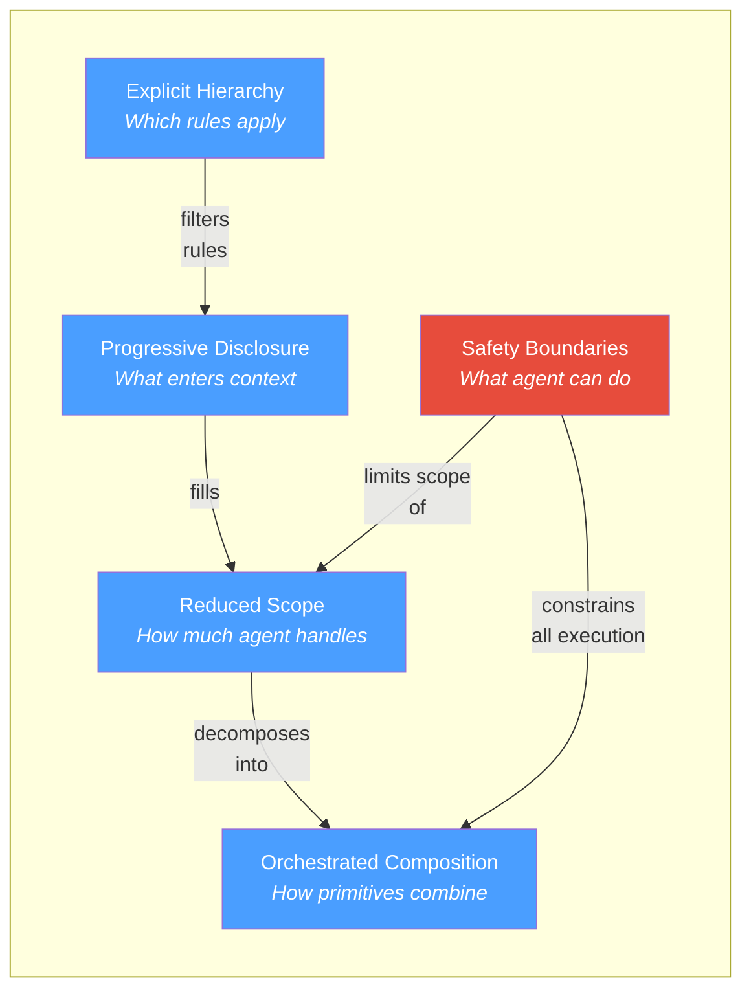

---

### Visual: The Vibe Coding Cliff

- **Location**: Chapter 1, Section "The Vibe Coding Cliff" (after the three bullet points: context exhaustion, hallucinated interfaces, convention violations)
- **Audience**: C-level
- **Type**: XY chart (conceptual)
- **Purpose**: The chapter's central metaphor — reliability drops as codebase complexity rises — is described in prose but never shown. A single curve communicates the core thesis of the entire book faster than any paragraph. C-level readers will re-reference this mental model throughout Block 1.
- **Replaces**: Supplements the prose; does not replace it
- **Spec**:

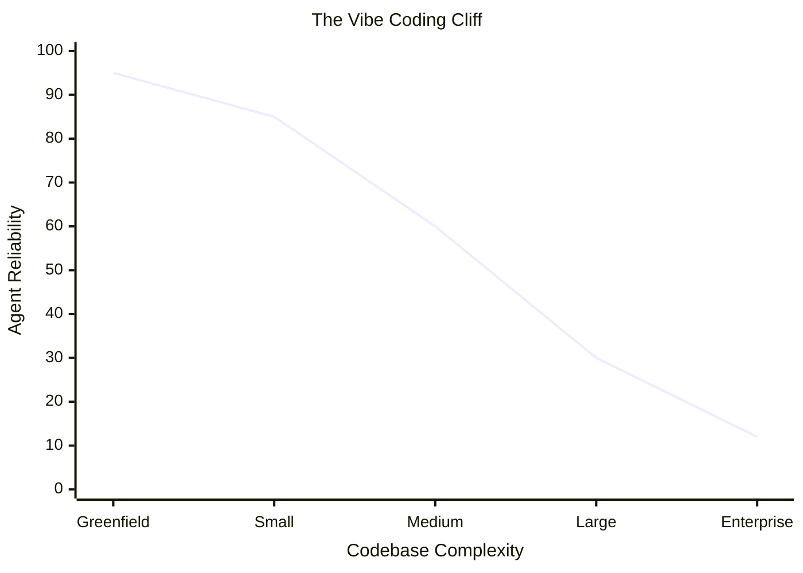

> *Caption: Agent output quality degrades as codebase complexity increases — not because models are weak, but because unstructured context cannot represent the knowledge that makes complex systems coherent.*

---

## Chapter 2: The AI-Native Landscape

### Visual: Four Phases of AI-Assisted Development

- **Location**: Chapter 2, Section "From Autocomplete to Agents" (above the existing phase table)
- **Audience**: C-level
- **Type**: Timeline / progression
- **Purpose**: The four-phase evolution (Completion → Conversational → Agentic → Orchestrated SDLC) is the chapter's structural backbone. The existing table captures detail, but a horizontal progression diagram communicates the trajectory and lets executives instantly locate "where we are" vs. "where the market is going." Faster than scanning four paragraphs.
- **Replaces**: Supplements the existing table (which remains for detail)
- **Spec**:

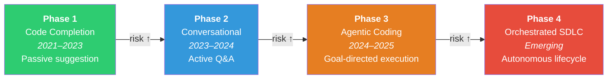

> *Caption: Each phase increases both capability and risk. Most organisations evaluate Phase 1–2 while their developers already operate at Phase 3.*

---

### Visual: Coding Tool vs. Delivery Platform — Two Buying Motions

- **Location**: Chapter 2, Section "Two Buying Motions, One Problem"
- **Audience**: C-level
- **Type**: Flowchart (convergence)
- **Purpose**: The chapter describes two separate adoption vectors (bottom-up developer choice vs. top-down platform mandate) that must converge. The spatial relationship — two separate streams merging into one strategy — is inherently visual. Prose alone forces the reader to hold both streams in memory.
- **Replaces**: Supplements the prose description
- **Spec**:

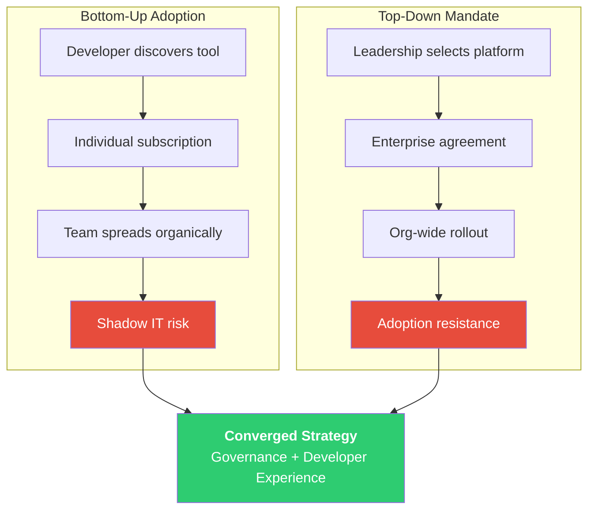

---

### Visual: 8-Phase SDLC Evaluation Buckets

- **Location**: Chapter 2, Section "The 8-Phase Evaluation Framework" (after the 8-phase table)
- **Audience**: C-level
- **Type**: Grouped flowchart
- **Purpose**: The text groups eight phases into three buckets (Intent, Build, Operate). The grouping is mentioned in prose but the visual relationship — which phases cluster and where agent maturity is concentrated — communicates instantly what takes three paragraphs to explain.
- **Replaces**: Supplements the bucket description at lines 150–156
- **Spec**:

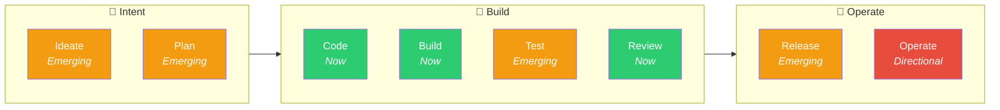

> *Caption: Green = mature (Now). Amber = emerging. Red = directional. Most organisations have invested only in the Build bucket. The next high-value gains are in Plan, Test, and Review.*

---

## Chapter 3: The Business Case

### Visual: The Adoption J-Curve

- **Location**: Chapter 3, Section "The Adoption Timeline"
- **Audience**: C-level
- **Type**: XY chart
- **Purpose**: The adoption timeline — setup → valley → inflection → compounding — is described across four paragraphs. For a CFO or board audience, a single curve showing "investment valley then compounding returns" is the most powerful frame. This is the visual executives will remember when patience wears thin at month 3.
- **Replaces**: Supplements the four-paragraph timeline narrative
- **Spec**:

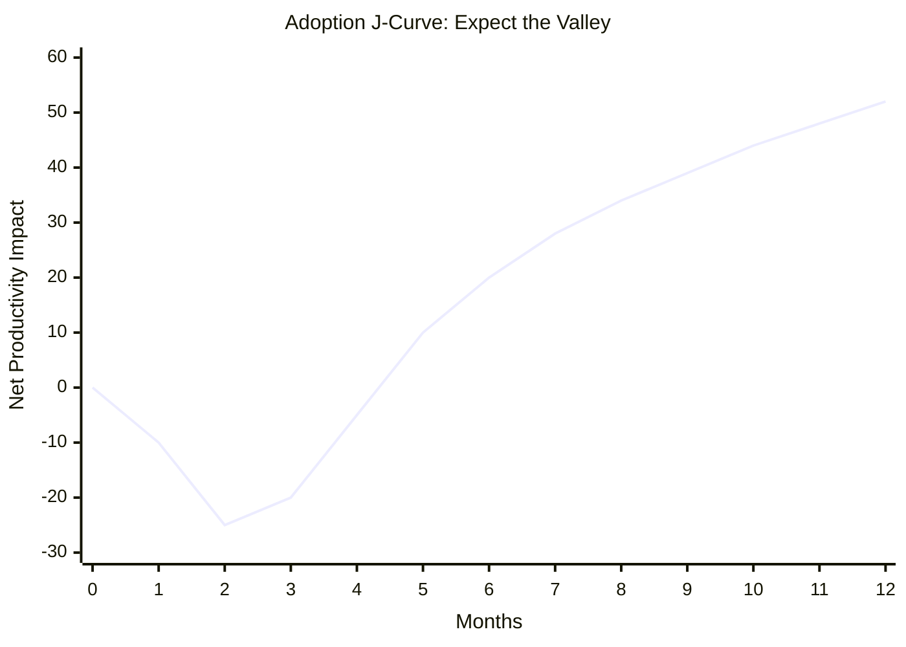

> *Caption: Months 1–3 are an investment valley. Inflection begins around month 4 as context accumulates. Teams that abandon during the valley never reach the compounding phase.*

---

### Visual: TCO Composition — Where the Money Actually Goes

- **Location**: Chapter 3, Section "What It Actually Costs" (after the TCO table)
- **Audience**: C-level
- **Type**: Pie chart
- **Purpose**: The chapter's central insight — "tool licenses are 8–13% of total cost" — is stated in prose and buried in a table. A pie chart makes the proportion viscerally obvious. When a CFO sees that tool licenses are a thin sliver, the conversation shifts from "how much does the tool cost" to "how much does the full investment cost."
- **Replaces**: Supplements the TCO table
- **Spec**:

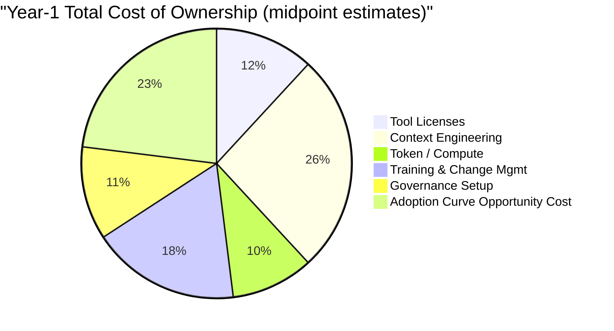

> *Caption: Tool licenses represent roughly 12% of the total Year-1 investment. Context engineering is the largest cost — and the one that determines whether the rest pays off.*

---

## Chapter 4: The Reference Architecture

### 🔼 Upgrade: Three-Layer Stack Diagram

- **Location**: Chapter 4, Section "The Three Layers" (lines 19–42)
- **Audience**: Both
- **Type**: Layered stack diagram
- **Purpose**: The existing ASCII art is functional but visually heavy and hard to scan. A Mermaid rendering preserves the same information with cleaner visual hierarchy, labeled bidirectional flows, and better readability in any markdown renderer.
- **Replaces**: The ASCII block at lines 19–42
- **Spec**:

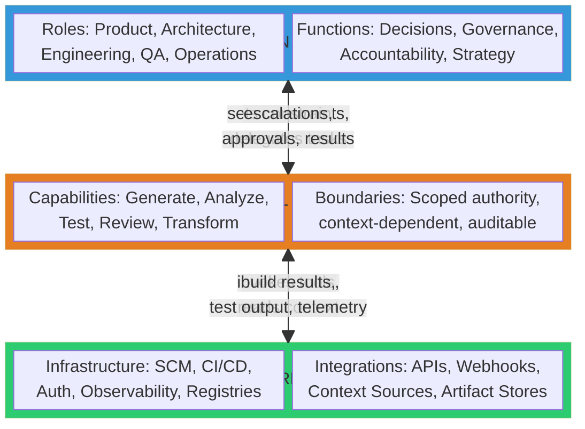

> *Note: If the `block-beta` syntax does not render in your viewer, use the flowchart fallback below:*

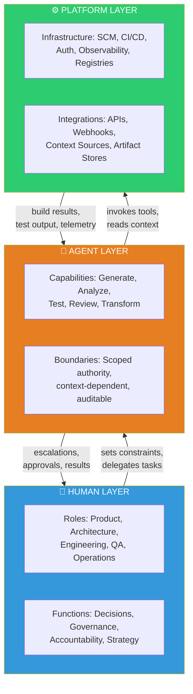

---

### 🔼 Upgrade: Lifecycle Phase × Layer Matrix

- **Location**: Chapter 4, Section "Mapping the Layers Across the Lifecycle" (lines 53–76)
- **Audience**: C-level
- **Type**: Structured table (keep as-is or convert to a simplified Mermaid block)
- **Purpose**: The existing ASCII grid is dense and hard to parse in many markdown renderers — fixed-width formatting breaks. Recommendation: **keep this as a markdown table** (it already nearly is one), but pair it with a simplified visual that shows just the maturity tier per phase. The detail table stays for practitioners; the maturity bar gives executives the one-glance summary.
- **Replaces**: Supplements the ASCII grid
- **Spec**:

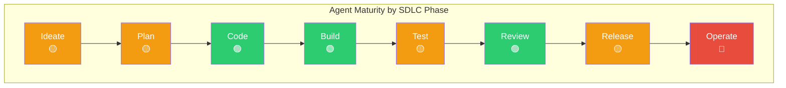

> *Caption: 🟢 Now — production-ready across vendors. 🟡 Emerging — available but limited. 🔴 Directional — not yet production-ready.*

---

### 🔼 Upgrade: Context Compounding Flywheel

- **Location**: Chapter 4, Section "The Compounding Mechanism" (lines 170–176)
- **Audience**: Both
- **Type**: Cycle diagram
- **Purpose**: The existing ASCII flywheel is minimal and misses the reinforcing nature of the loop. A Mermaid cycle diagram makes the compounding mechanism — the chapter's most important strategic insight — visually memorable and re-referenceable.
- **Replaces**: The ASCII block at lines 170–176
- **Spec**:

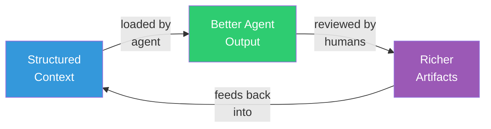

> *Caption: Context compounds. Each cycle — agent consumes context, produces output, human reviews and enriches — makes the next cycle more reliable. This is the context moat.*

---

### Visual: Three Context Domains

- **Location**: Chapter 4, Section "The Context Moat" (after the context domain ASCII blocks, lines 139–156)
- **Audience**: Both
- **Type**: Layered stack
- **Purpose**: The three context domains (Work, Data, Code) are shown as ASCII boxes but without their relationship to each other or to the agent. A Mermaid diagram shows them as layers that the agent draws from, with the most immediately actionable domain (Code) at the base.
- **Replaces**: The ASCII blocks at lines 139–156
- **Spec**:

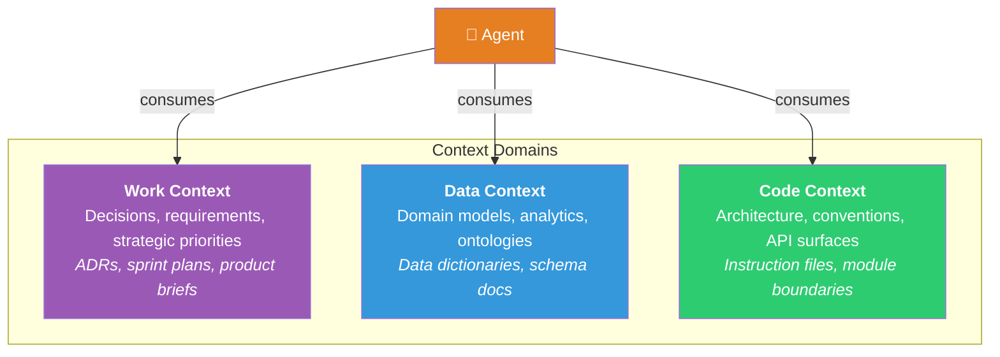

> *Caption: Code Context is the highest-ROI starting investment — it maps directly to instruction files current tools already support. Work and Data context require more organizational integration.*

---

## Chapter 5: Governance for AI-Assisted Delivery

### Visual: Governance Maturity Progression

- **Location**: Chapter 5, Section "Governance Readiness Checklist" (after or alongside the 6-row checklist table)
- **Audience**: C-level
- **Type**: Maturity progression
- **Purpose**: The checklist table has three maturity columns (None → Basic → Enterprise) across six capabilities. For a board audience, a single visual showing "where we are" across all six dimensions is faster than scanning a 6×4 table. This is the visual a CISO puts on a slide.
- **Replaces**: Supplements the checklist table
- **Spec**:

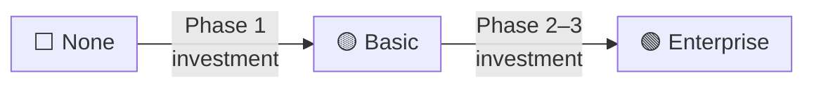

> *Note: Mermaid lacks a native radar/spider chart. The maturity progression is best represented as a simple decision aid — the recommended visual is actually the table itself, which is already well-structured. Instead, add this decision-start diagram:*

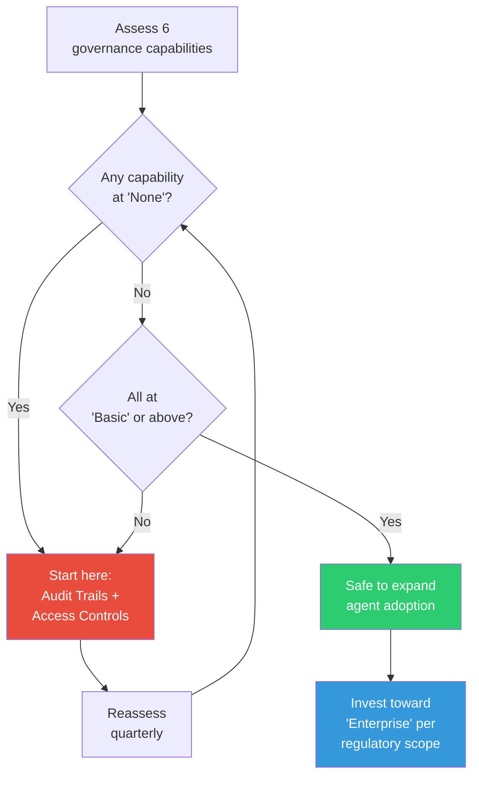

> *Caption: The governance floor: no capability at "None" before expanding agent adoption. Start with audit trails and access controls — they unblock everything else.*

---

### Visual: Risk Taxonomy Overview

- **Location**: Chapter 5, Section "Risk Taxonomy" (before the six subsections)
- **Audience**: C-level
- **Type**: Mind map / overview
- **Purpose**: The six risk categories are presented as sequential subsections. An executive scanning the chapter needs to see all six at once before diving into detail. A single overview diagram serves as both a table of contents and a mental anchor.
- **Replaces**: Supplements the section headings
- **Spec**:

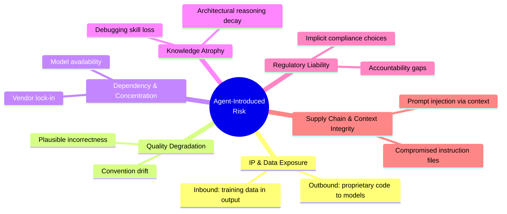

---

## Chapter 6: Team Structures for AI-Augmented Delivery

### Visual: Time Allocation Shift

- **Location**: Chapter 6, Section "What Shifts, What Stays" (after the time allocation table)
- **Audience**: C-level
- **Type**: Before/after bar comparison
- **Purpose**: The time allocation table shows the shift numerically, but the proportional change — writing code drops dramatically while review and specification rise — is the strategic insight. A side-by-side visual makes the rebalancing immediately obvious. This is the visual a VP Engineering uses to explain "what changes about my team."
- **Replaces**: Supplements the table
- **Spec**:

```mermaid
---
config:
    xyChart:
        titleFontSize: 14
---
xychart-beta
    title "Developer Time Allocation Shift"
    x-axis ["Write Code", "Read Code", "Review", "Spec & Design", "Debug", "Context Eng.", "Meetings"]
    y-axis "% of Time" 0 --> 35
    bar [32, 22, 12, 12, 17, 0, 12]
    bar [12, 17, 22, 22, 12, 12, 12]
```

> *Caption: Blue = pre-agentic. Orange = with agentic tools. Writing code drops from ~32% to ~12%. Review and specification each nearly double. Context engineering appears as a new 10–15% allocation.*

---

### Visual: Junior Engineer Development Models

- **Location**: Chapter 6, Section "The Junior Pipeline"
- **Audience**: Both
- **Type**: Comparison flowchart
- **Purpose**: The three models (Review-intensive → Agent-assisted learning → Specification-first) are described in consecutive paragraphs. A visual showing the three models and how they compose into a first-year progression communicates the "combine all three" recommendation better than prose.
- **Replaces**: Supplements the three model descriptions
- **Spec**:

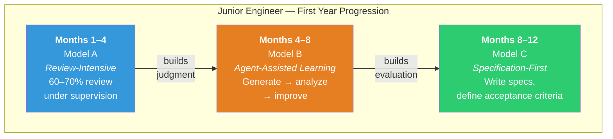

> *Caption: No single model is sufficient. A structured first year combines review-intensive apprenticeship, agent-assisted learning, and specification-first work — with proportions shifting as capability grows.*

---

## Chapter 7: Planning the Transition

### Visual: Three-Phase Adoption Funnel

- **Location**: Chapter 7, Section "Phased Adoption"
- **Audience**: C-level
- **Type**: Funnel / progression with gates
- **Purpose**: The three phases (Pilot → Expand → Scale) with entry criteria, exit signals, and rollback triggers form the chapter's operational backbone. Executives need to see the full progression and its decision gates in a single visual — not read three multi-paragraph subsections. This is the "adoption roadmap" visual that goes on a planning slide.
- **Replaces**: Supplements the three-phase narrative
- **Spec**:

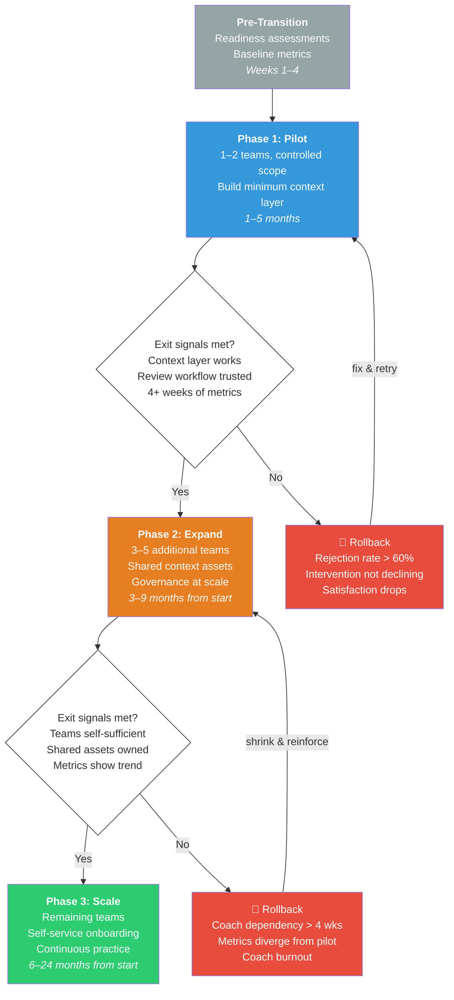

> *Caption: Each phase has explicit exit signals and rollback criteria. Moving forward without meeting exit signals is the single most common adoption mistake.*

---

### Visual: Team Readiness Radar — Four Dimensions

- **Location**: Chapter 7, Section "Team Readiness Assessment" (after the readiness matrix table)
- **Audience**: C-level
- **Type**: Decision tree
- **Purpose**: The four readiness dimensions (Codebase, Process, Skill, Cultural) determine sequencing. A quick decision tree shows leaders how to triage: which dimension blocks what, and where to invest first. Faster than reading four paragraphs and a table.
- **Replaces**: Supplements the readiness matrix
- **Spec**:

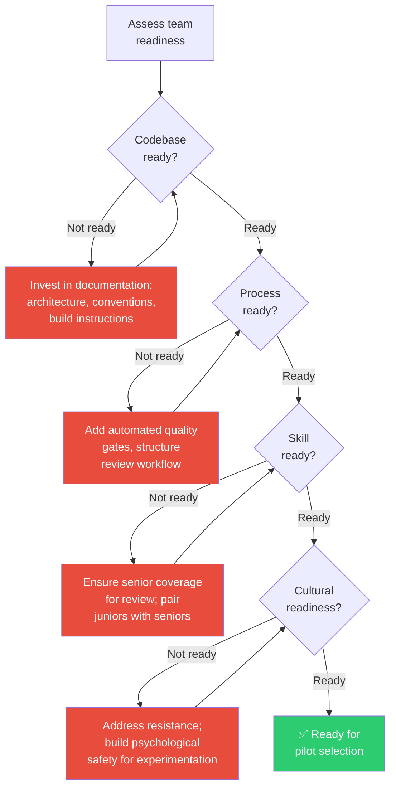

> *Caption: Readiness assessment is a sequencing tool, not a gate. Teams "not ready" in codebase or skill readiness need the most preparation and should start last.*

---

## Cross-Chapter Consistency Notes

### Visual language conventions used throughout this audit

| Element | Color | Meaning |
|---|---|---|
| Green (`#2ecc71`) | Mature / ready / success | Now-stage capabilities, ready teams, positive outcomes |
| Blue (`#3498db`) | Primary / informational | Human layer, structural elements, Phase 1 |
| Orange (`#e67e22`) | Transition / emerging | Agent layer, in-progress phases, Phase 2 |
| Red (`#e74c3c`) | Risk / not ready / rollback | Safety boundaries, rollback triggers, gaps |
| Purple (`#9b59b6`) | Knowledge / artifacts | Context artifacts, enriched outputs |

### Visual type distribution

| Type | Count | Chapters |
|---|---|---|
| Flowchart | 7 | 1, 2 (×2), 4, 5, 7 (×2) |
| XY chart | 3 | 1, 3, 6 |
| Pie chart | 1 | 3 |
| Mind map | 1 | 5 |
| Layered stack | 2 | 4 (×2) |
| Cycle diagram | 1 | 4 |
| Timeline/progression | 1 | 6 |

Distribution is balanced — no single visual type dominates.

### Diagrams flagged for removal

None. All existing tables serve a purpose the visual supplements do not replace. The four ASCII diagrams in Chapters 1 and 4 should be **replaced** (not supplemented) by their Mermaid upgrades — the Mermaid versions convey the same information with better readability.
