# Visual Audit — Block 2 + Closing (Chapters 8–15)

**Auditor:** Illustrator — Visual Strategist
**Scope:** Practitioner-facing chapters. Visual types: flowcharts, sequence diagrams, file trees, before/after, state machines.
**Principle:** One idea per visual. Every diagram must pass the "faster than prose" test.

---

## Existing ASCII Diagrams — Upgrade Candidates

The following ASCII diagrams already exist in the manuscript. Each is assessed for upgrade to Mermaid.

| Location | Description | Verdict |
|---|---|---|
| Ch 8 §"When to Use Agents" | Decision flowchart (lines 82–115) | **Upgrade** — complex branching is clearer as a Mermaid flowchart with styled nodes |
| Ch 9 §"How Primitives Compose" | Nesting hierarchy (lines 376–382) | **Keep ASCII** — 6-line indented tree is elegant as-is; Mermaid adds bulk without clarity |
| Ch 9 §"Feedback Loop" | Diagnosis tree (lines 558–569) | **Upgrade** — branching diagnostic flow benefits from Mermaid flowchart |
| Ch 9 §"Before and After" | Two file trees (lines 452–467, 482–516) | **Keep ASCII** — file trees render best as monospace text |
| Ch 10 §"Reduced Scope / Phase decomposition" | 3-phase linear flow (lines 122–134) | **Keep ASCII** — 3-step linear; Mermaid adds overhead, no clarity gain |
| Ch 11 §"Context Budget" | Stacked block (lines 14–30) | **Upgrade** — proportional budget is better as a Mermaid pie or labeled block diagram |
| Ch 12 §"Writer/Reviewer/Tester" | 3-stage linear (lines 60–68) | **Keep ASCII** — compact, 3 nodes; Mermaid adds no clarity |
| Ch 12 §"Domain Teams" | 2-column box (lines 78–92) | **Keep ASCII** — side-by-side boxes are effective as monospace |
| Ch 12 §"Audit/Execute/Validate" | 5-stage pipeline (lines 148–166) | **Upgrade** — 5 stages with read-only/read-write annotations benefit from Mermaid |
| Ch 12 §"One-File-One-Agent" | SAFE/UNSAFE comparison (lines 187–196) | **Keep ASCII** — compact comparison; effective as-is |
| Ch 12 §"Wave-Based Parallelism" | 3-wave dependency (lines 204–222) | **Upgrade** — wave dependency with parallel lanes is a natural Mermaid flowchart |
| Ch 12 §"Pipeline Parallelism" | Gantt-style (lines 233–240) | **Upgrade** — natural Mermaid gantt chart |
| Ch 12 §"Session Isolation" | 3 sessions → filesystem (lines 366–379) | **Keep ASCII** — the box layout is effective as monospace |
| Ch 12 §"Putting It Together" | 7-step orchestration (lines 412–437) | **Upgrade** — branching loop is clearer as Mermaid flowchart |
| Ch 13 §"Five Phases" | AUDIT→SHIP with ADAPT loop (lines 16–20) | **Upgrade** — core meta-process diagram deserves first-class Mermaid treatment |
| Ch 13 §"Dependency Graph" | 4-wave linear (lines 136–140) | **Keep ASCII** — 4-line description; Mermaid adds overhead |
| Ch 13 §"ADAPT Loop" | DETECT→EXECUTE (lines 251–256) | **Keep ASCII** — 4-step linear; compact enough |
| Ch 14 §"Failure Mode Decision Tree" | Diagnostic tree (lines 398–428) | **Upgrade** — multi-branch decision tree with 4 levels; Mermaid makes paths scannable |

**Summary:** 9 upgrades recommended, 9 keep as-is.

---

## Chapter 8: The Practitioner's Mindset

### Visual 8-1: Agent vs. Autocomplete Mental Model

- **Location**: Chapter 8, Section "The Autocomplete Trap"
- **Audience**: Practitioner
- **Type**: Comparison flowchart
- **Purpose**: Instantly shows the structural difference between autocomplete (single-step, low-risk) and agent (multi-step, high-risk) interaction models — a concept the prose takes 3 paragraphs to build
- **Replaces**: Paragraphs 2–3 of "The Autocomplete Trap" (supplements, doesn't replace)
- **Spec**:

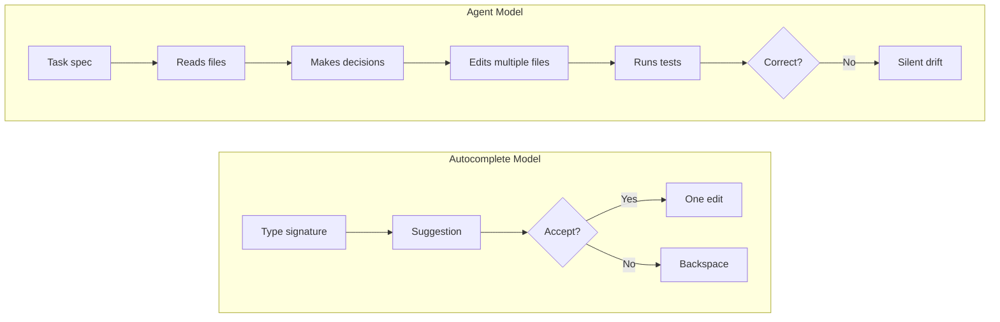

### Visual 8-2: Three Practitioner Roles (Upgrade of prose)

- **Location**: Chapter 8, Section "Your Three Roles"
- **Audience**: Practitioner
- **Type**: State machine
- **Purpose**: Shows the three roles as states the practitioner cycles through, with transition triggers — faster than reading 4 paragraphs to understand when you shift roles
- **Replaces**: Supplements the 3-role description and the PR #394 mapping
- **Spec**:

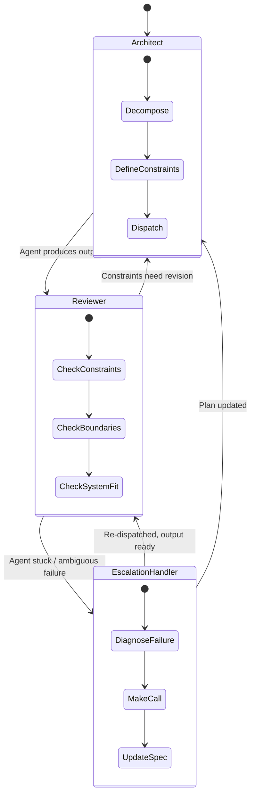

### Visual 8-3: When to Use Agents Decision Flowchart (UPGRADE)

- **Location**: Chapter 8, Section "When to Use Agents and When to Code Manually"
- **Audience**: Practitioner
- **Type**: Decision tree / flowchart
- **Purpose**: The existing ASCII decision tree is the chapter's most-referenced artifact. Upgrading to Mermaid adds styled decision nodes, clear YES/NO paths, and terminal styling for outcomes.
- **Replaces**: Existing ASCII flowchart (lines 82–115)
- **Spec**:

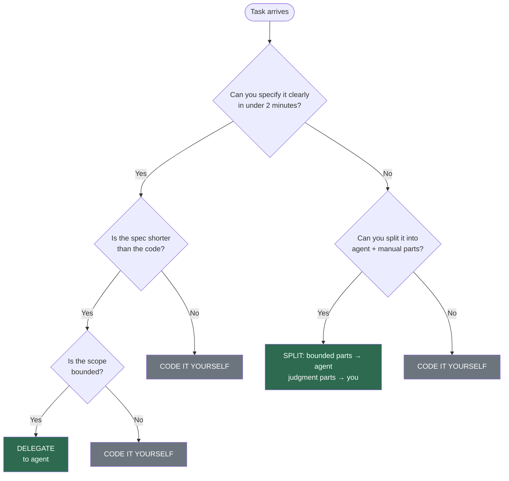

---

## Chapter 9: The Instrumented Codebase

### Visual 9-1: Six Primitives at a Glance

- **Location**: Chapter 9, Section "The Six Primitive Types"
- **Audience**: Practitioner
- **Type**: Layered block diagram
- **Purpose**: The six primitives are the conceptual backbone of the chapter. A single diagram showing all six with their one-line purpose is faster than scanning six subsections to recall the taxonomy
- **Replaces**: Supplements the opening of "The Six Primitive Types"
- **Spec**:

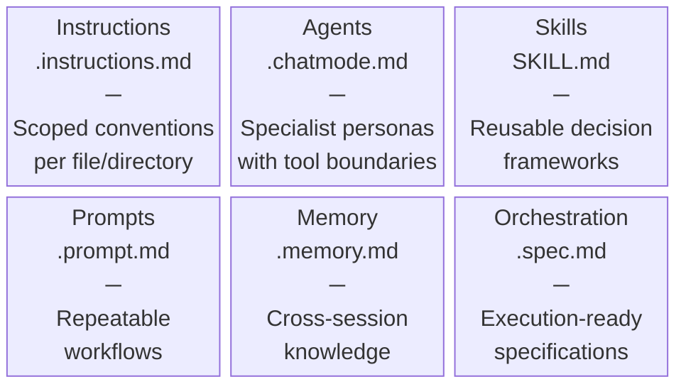

### Visual 9-2: Feedback Loop — Diagnose & Fix (UPGRADE)

- **Location**: Chapter 9, Section "The Feedback Loop"
- **Audience**: Practitioner
- **Type**: Flowchart
- **Purpose**: The existing ASCII diagnostic tree has 6 branches from a root. Mermaid makes the branching structure scannable with a single glance
- **Replaces**: Existing ASCII tree (lines 558–569)
- **Spec**:

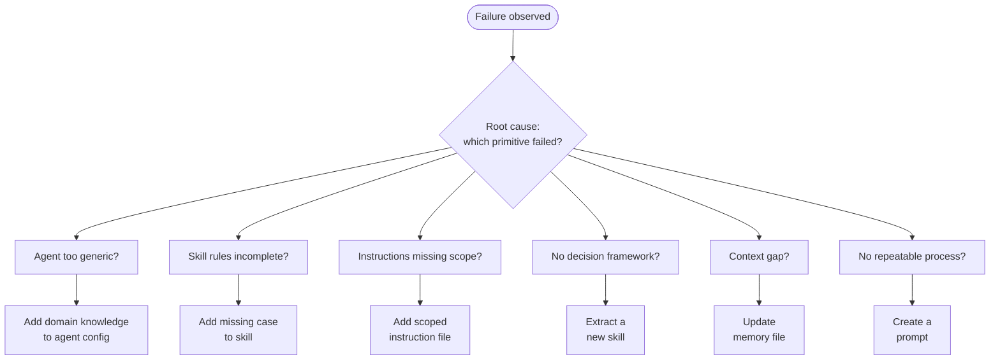

### Visual 9-3: Before vs. After — Instrumented Codebase Metrics

- **Location**: Chapter 9, Section "What the numbers look like"
- **Audience**: Both
- **Type**: Table (already exists — no diagram needed, but worth noting it passes the test)
- **Purpose**: Already effective as a markdown table. No visual needed.
- **Note**: Flagged for completeness; no action.

### Visual 9-4: Instrumentation Audit — Five Steps

- **Location**: Chapter 9, Section "The Instrumentation Audit"
- **Audience**: Practitioner
- **Type**: Sequence/flow diagram
- **Purpose**: The 5-step audit process is described across multiple subsections with examples. A compact flow shows the full pipeline at a glance before the reader dives into each step
- **Replaces**: Supplements Steps 1–5 (lines 402–442)
- **Spec**:

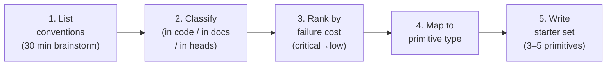

---

## Chapter 10: The PROSE Specification

### Visual 10-1: PROSE Constraint Dependency Web

- **Location**: Chapter 10, Section "When Constraints Are Missing"
- **Audience**: Practitioner
- **Type**: Graph diagram
- **Purpose**: The three failure stories demonstrate that constraints are interdependent. A diagram showing which constraint pairs reinforce each other is faster than reading 3 multi-paragraph stories to understand the relationships
- **Replaces**: Supplements the opening of "When Constraints Are Missing" (lines 363–373)
- **Spec**:

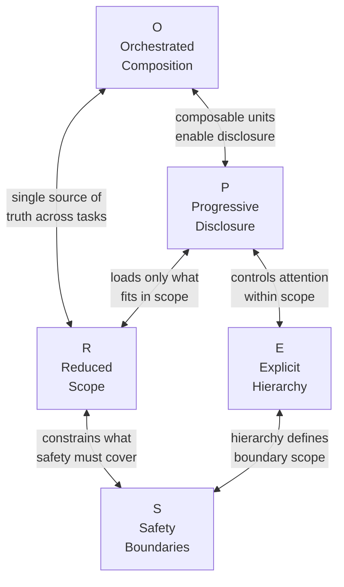

### Visual 10-2: Task Decomposition — JWT Worked Example

- **Location**: Chapter 10, Section "Applying the Constraints: A Worked Example"
- **Audience**: Practitioner
- **Type**: Sequence diagram
- **Purpose**: The 5-session JWT decomposition (lines 484–491) is described in a table. A sequence diagram shows the temporal ordering and the agent-switching between sessions, which the table doesn't convey
- **Replaces**: Supplements the session table
- **Spec**:

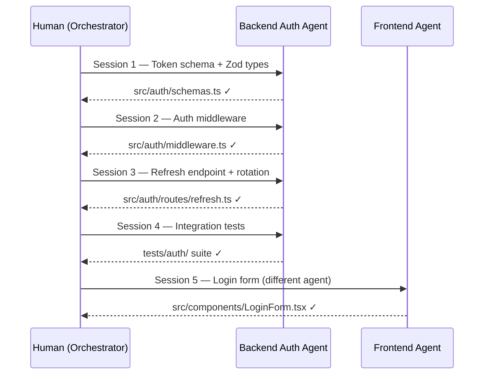

### Visual 10-3: Instruction Hierarchy — Scope Resolution

- **Location**: Chapter 10, Section "E — Explicit Hierarchy"
- **Audience**: Practitioner
- **Type**: Flowchart (bottom-up resolution)
- **Purpose**: The AGENTS.md resolution walk (lines 294–309) is described as prose. A diagram showing the walk-up from file to root makes the resolution order instantly visible
- **Replaces**: Supplements lines 294–309
- **Spec**:

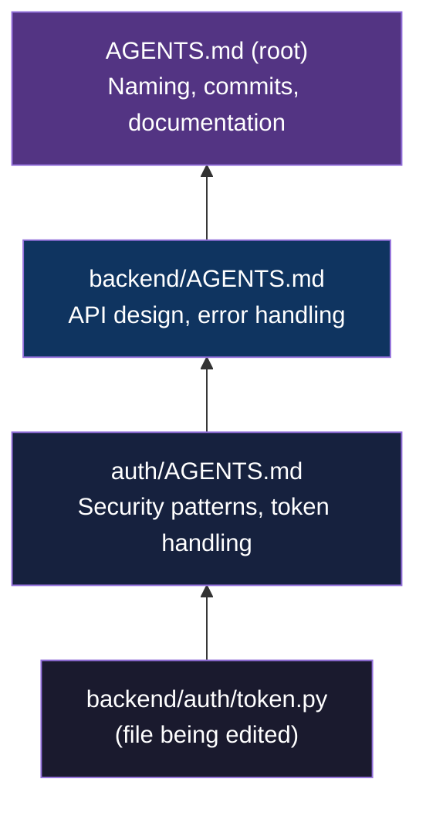

---

## Chapter 11: Context Engineering

### Visual 11-1: Context Budget Allocation (UPGRADE)

- **Location**: Chapter 11, Section "The Context Budget"
- **Audience**: Both
- **Type**: Pie chart
- **Purpose**: The existing ASCII stacked block shows proportional allocation but lacks visual proportionality. A Mermaid pie chart makes the budget trade-offs instantly scannable — especially the small "working memory" slice that practitioners underestimate
- **Replaces**: Existing ASCII block (lines 14–30)
- **Spec**:

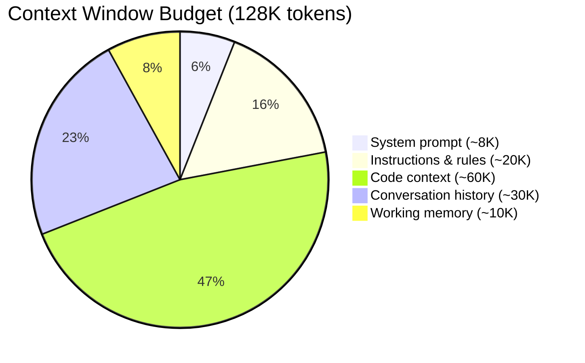

### Visual 11-2: Instruction Hierarchy — Three Layers

- **Location**: Chapter 11, Section "The Instruction Hierarchy"
- **Audience**: Practitioner
- **Type**: Layered funnel / pyramid
- **Purpose**: The three layers (global → directory → file) are described across multiple subsections. A single diagram showing narrowing scope with example patterns makes the hierarchy graspable at a glance
- **Replaces**: Supplements the hierarchy subsections (lines 50–130)
- **Spec**:

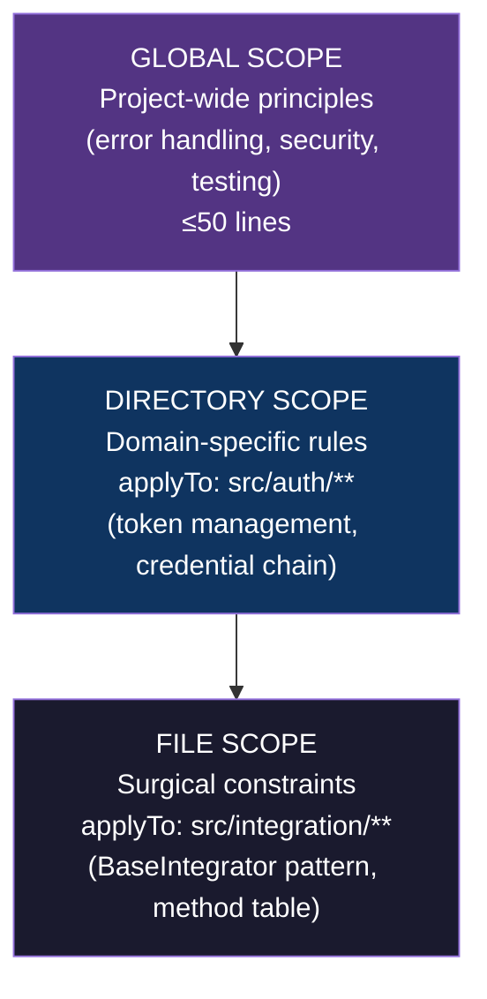

### Visual 11-3: Session Reset Triggers

- **Location**: Chapter 11, Section "Memory and Retrieval — When to reset"
- **Audience**: Practitioner
- **Type**: Decision tree
- **Purpose**: The three reset triggers (stale references, error spirals, conversation length) are listed as prose. A quick decision tree lets practitioners check "should I reset?" without re-reading the section
- **Replaces**: Supplements lines 224–230
- **Spec**:

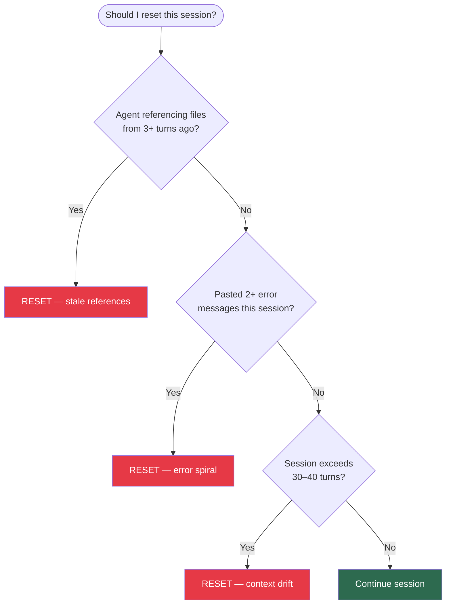

---

## Chapter 12: Multi-Agent Orchestration

### Visual 12-1: Audit / Execute / Validate Pipeline (UPGRADE)

- **Location**: Chapter 12, Section "Pattern 3: Audit / Execute / Validate"
- **Audience**: Practitioner
- **Type**: Flowchart with annotations
- **Purpose**: The existing ASCII pipeline has 5 stages with read-only/read-write annotations that are easy to miss. Mermaid adds visual separation between the read-only and read-write phases, making the safety boundary visible
- **Replaces**: Existing ASCII pipeline (lines 148–166)
- **Spec**:

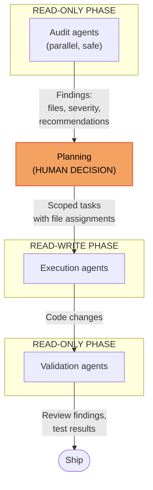

### Visual 12-2: Wave-Based Parallelism (UPGRADE)

- **Location**: Chapter 12, Section "Wave-Based Parallelism"
- **Audience**: Practitioner
- **Type**: Gantt chart
- **Purpose**: The existing ASCII shows dependency structure but not the temporal dimension. A Mermaid gantt makes the parallel execution within waves and sequential ordering between waves immediately clear
- **Replaces**: Existing ASCII (lines 204–222)
- **Spec**:

```mermaid
gantt
    title Wave Execution Timeline
    dateFormat X
    axisFormat %s

    section Wave 0 — Foundation
    Agent A (types)        :a, 0, 5
    Agent B (utilities)    :b, 0, 4
    Agent C (config)       :c, 0, 3
    Test + commit          :crit, t0, 5, 7

    section Wave 1 — Core
    Agent D (migration)    :d, 7, 12
    Agent E (API)          :e, 7, 11
    Agent F (auth)         :f, 7, 13
    Test + commit          :crit, t1, 13, 15

    section Wave 2 — Integration
    Agent G (wiring)       :g, 15, 19
    Agent H (tests)        :h, 15, 18
    Test + commit          :crit, t2, 19, 21
```

### Visual 12-3: Pipeline Parallelism (UPGRADE)

- **Location**: Chapter 12, Section "Pipeline Parallelism"
- **Audience**: Practitioner
- **Type**: Gantt chart
- **Purpose**: The existing ASCII gantt is compact but hard to read. Mermaid gantt renders proportional time and overlaps clearly
- **Replaces**: Existing ASCII gantt (lines 233–240)
- **Spec**:

```mermaid
gantt
    title Pipeline Parallelism
    dateFormat X
    axisFormat %s

    section Wave 0
    Agents execute         :a0, 0, 8
    Review (read-only)     :r0, 8, 12
    Tests (read-only)      :t0, 8, 18

    section Wave 1
    Agents execute         :a1, 12, 24
    Review (read-only)     :r1, 24, 28
```

### Visual 12-4: Orchestration Workflow (UPGRADE)

- **Location**: Chapter 12, Section "Putting It Together"
- **Audience**: Practitioner
- **Type**: Flowchart with loop
- **Purpose**: The existing ASCII 7-step flow has a branch loop that is hard to parse in monospace. Mermaid makes the loop from VALIDATE back to DISPATCH visually obvious
- **Replaces**: Existing ASCII (lines 412–437)
- **Spec**:

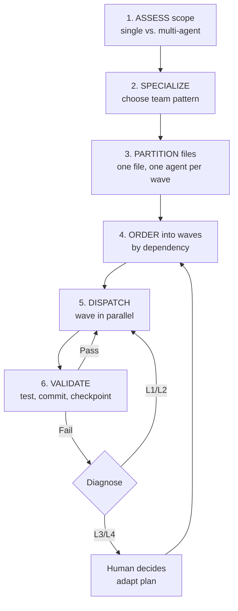

---

## Chapter 13: The Execution Meta-Process

### Visual 13-1: Five-Phase Meta-Process (UPGRADE)

- **Location**: Chapter 13, Section "The Five Phases"
- **Audience**: Practitioner
- **Type**: Flowchart with ADAPT loop
- **Purpose**: This is the single most important process diagram in Block 2. The existing ASCII is 5 lines. Mermaid makes the ADAPT loop — the resilience mechanism — first-class visible
- **Replaces**: Existing ASCII (lines 16–20)
- **Spec**:

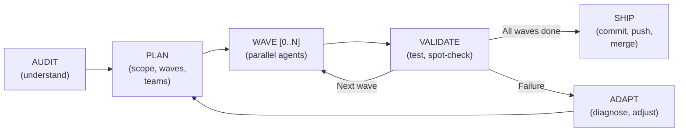

### Visual 13-2: PR #394 Timeline

- **Location**: Chapter 13, Section "PR #394: The Worked Example"
- **Audience**: Practitioner
- **Type**: Gantt chart
- **Purpose**: The timeline (lines 194–206) is described in prose paragraphs. A gantt chart makes the 90-minute execution scannable — practitioners can see where time was spent and where the recovery wave occurred
- **Replaces**: Supplements the timeline prose
- **Spec**:

```mermaid
gantt
    title PR #394 — 70 Files, 90 Minutes
    dateFormat X
    axisFormat %s min

    section Audit
    2 explore agents (parallel) :a, 0, 3

    section Plan
    Review + approve            :p, 3, 8

    section Wave 0 — Foundation
    2 agents (parallel)         :w0, 8, 13

    section Wave 1+2 — Core & Migration
    5 agents (sequence)         :w12, 13, 21

    section Wave 2b — Recovery
    2 replacement agents        :crit, w2b, 21, 28

    section Wave 3 — Polish
    1 agent (unicode cleanup)   :w3, 28, 32

    section Validate & Ship
    Spot-check + merge          :v, 32, 34
```

### Visual 13-3: Checkpoint Components

- **Location**: Chapter 13, Section "Checkpoint Discipline"
- **Audience**: Practitioner
- **Type**: Flowchart
- **Purpose**: The four checkpoint components (test gate, spot-check, commit, plan review) are described in prose subsections. A compact flow shows the checkpoint as a unit — practitioners need to know the sequence is mandatory
- **Replaces**: Supplements lines 236–244
- **Spec**:

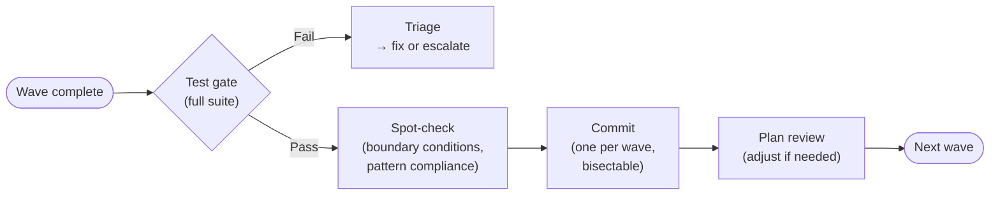

---

## Chapter 14: Anti-Patterns and Failure Modes

### Visual 14-1: Anti-Pattern Taxonomy by Constraint (existing table — complement)

- **Location**: Chapter 14, Section "The Taxonomy"
- **Audience**: Practitioner
- **Type**: Grouped bar / cluster diagram
- **Purpose**: The 19-row taxonomy table is comprehensive but hard to scan for patterns. A grouped visual showing anti-patterns clustered by PROSE constraint reveals that Safety Boundaries has the most violations — a prioritization insight the flat table obscures
- **Replaces**: Supplements the taxonomy table
- **Spec**:

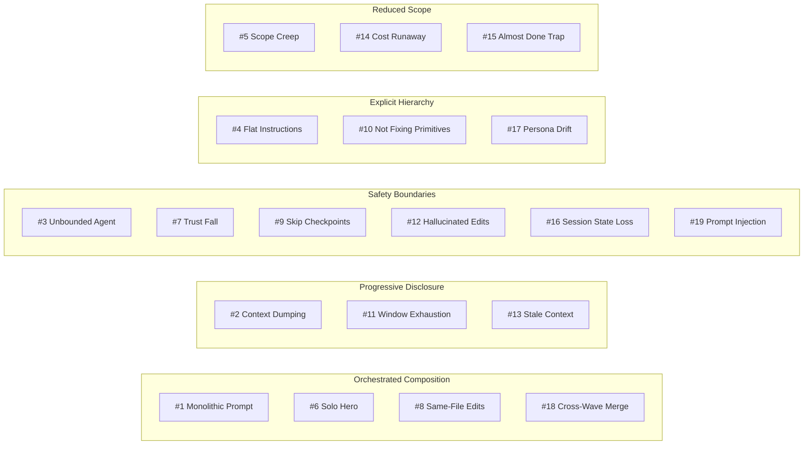

### Visual 14-2: Failure Mode Decision Tree (UPGRADE)

- **Location**: Chapter 14, Section "The Failure Mode Decision Tree"
- **Audience**: Practitioner
- **Type**: Decision tree
- **Purpose**: The existing ASCII decision tree has 4 levels of branching. Mermaid makes the YES/NO paths color-coded and scannable — practitioners use this in the moment of failure and need speed
- **Replaces**: Existing ASCII tree (lines 398–428)
- **Spec**:

```mermaid
flowchart TD
    START(["Something went wrong\nwith agent output"]) --> Q1{Code syntactically\nwrong?}

    Q1 -- Yes --> FIX1["Model capability issue\nStronger model, better examples,\nor do it manually"]
    Q1 -- No --> Q2{Tests fail?}

    Q2 -- Yes --> Q2a{Agent's code\nor pre-existing?}
    Q2a -- "Agent's" --> FIX2["Check: task too broad?\nContext stale?\nConstraint dropped?"]
    Q2a -- Pre-existing --> FIX2b["Separate issue\nDo not fix in this session"]

    Q2 -- No --> Q3{Follows your\nconventions?}

    Q3 -- No --> FIX3["Primitive issue\nRule missing? Wrong scope?\nToo much context noise?"]
    Q3 -- Yes --> Q4{Integrates correctly\nwith system?}

    Q4 -- No --> FIX4["Architectural issue\nRight interfaces visible?\nModule boundaries respected?"]
    Q4 -- Yes --> FIX5["Probably fine\nVerify edge cases: error paths,\nnull inputs, concurrency, auth"]

    style FIX1 fill:#e63946,color:#fff
    style FIX2 fill:#e76f51,color:#fff
    style FIX3 fill:#f4a261,color:#000
    style FIX4 fill:#e9c46a,color:#000
    style FIX5 fill:#2d6a4f,color:#fff
    style FIX2b fill:#6c757d,color:#fff
```

### Visual 14-3: Recovery Playbook — Six Steps

- **Location**: Chapter 14, Section "The Recovery Playbook"
- **Audience**: Practitioner
- **Type**: Flowchart
- **Purpose**: The 6-step recovery (lines 327–338) is a numbered list. A flowchart shows the mandatory ordering and the key action per step — practitioners in recovery mode scan, they don't read
- **Replaces**: Supplements lines 327–338
- **Spec**:

```mermaid
flowchart TD
    S1["1. STOP & ASSESS\nIdentify anti-pattern\nfrom taxonomy"] --> S2["2. SNAPSHOT\nCommit all\npassing code"]
    S2 --> S3["3. REVERT\nDiscard contaminated\nchanges"]
    S3 --> S4["4. DECOMPOSE\nBreak task into\nsmaller sub-tasks"]
    S4 --> S5["5. FIX PRIMITIVE\nAdd missing rule\nto instruction set"]
    S5 --> S6["6. RE-EXECUTE\nFresh session,\nclean context"]
```

---

## Chapter 15: What Comes Next

### Visual 15-1: Three-Tier Confidence Model

- **Location**: Chapter 15, Section "Three-Tier Honesty Applied"
- **Audience**: Both
- **Type**: Table (already exists and is effective — no diagram needed)
- **Note**: The existing table (lines 55–63) is compact and well-structured. Adding a visual would be decorative.

### Visual 15-2: Five Invariants

- **Location**: Chapter 15, Section "What Will Not Change"
- **Audience**: Both
- **Type**: Concept map
- **Purpose**: The five structural invariants (finite context, probabilistic output, explicit knowledge, human judgment, composition) each map back to a PROSE constraint. A visual showing these connections reinforces the closing argument that the constraints are durable
- **Replaces**: Supplements "What Will Not Change" (lines 38–49)
- **Spec**:

```mermaid
graph LR
    I1["Context remains\nfinite & fragile"] --> C1["Progressive\nDisclosure"]
    I2["Output remains\nprobabilistic"] --> C2["Safety\nBoundaries"]
    I3["Explicit knowledge\noutperforms implicit"] --> C3["Explicit\nHierarchy"]
    I4["Human judgment\n= bottleneck &\ndifferentiator"] --> C4["Reduced\nScope"]
    I5["Composition\nremains necessary"] --> C5["Orchestrated\nComposition"]
```

### Visual 15-3: First Week Action Timeline

- **Location**: Chapter 15, Section "Your First Week"
- **Audience**: Practitioner
- **Type**: Gantt / timeline
- **Purpose**: The 5-day plan (lines 88–117) is described in subsections. A compact timeline with deliverables makes it actionable at a glance — practitioners can print it and tape it to their monitor
- **Replaces**: Supplements the Day 1–5 subsections
- **Spec**:

```mermaid
gantt
    title Your First Week
    dateFormat YYYY-MM-DD
    axisFormat %A

    section Practitioner
    Audit one module              :d1, 2025-01-06, 1d
    Write 3 primitives            :d2, 2025-01-07, 1d
    Test against real task        :d3, 2025-01-08, 1d
    Measure & adjust              :d4, 2025-01-09, 1d
    Share & plan next steps       :d5, 2025-01-10, 1d
```

---

## Summary

| Chapter | Visuals Proposed | Upgrades | New |
|---|---|---|---|
| Ch 8 | 3 | 1 (decision flowchart) | 2 |
| Ch 9 | 3 | 1 (feedback loop) | 2 |
| Ch 10 | 3 | 0 | 3 |
| Ch 11 | 3 | 1 (context budget) | 2 |
| Ch 12 | 4 | 4 (pipeline, waves, gantt, orchestration loop) | 0 |
| Ch 13 | 3 | 1 (five phases) | 2 |
| Ch 14 | 3 | 1 (decision tree) | 2 |
| Ch 15 | 2 | 0 | 2 |
| **Total** | **24** | **9** | **15** |

### Visual Type Distribution

| Type | Count |
|---|---|
| Flowchart / Decision tree | 12 |
| Gantt chart | 4 |
| Sequence diagram | 1 |
| State machine | 1 |
| Graph / Concept map | 3 |
| Block / Pie | 2 |
| Layered funnel | 1 |

No chapter exceeds 4 visuals. No chapter has 0. Types are distributed — no chapter is all flowcharts. Cross-chapter visual language is consistent: green = proceed/success, red = stop/reset, gray = manual/fallback, decision diamonds are always yellow-bordered questions.
